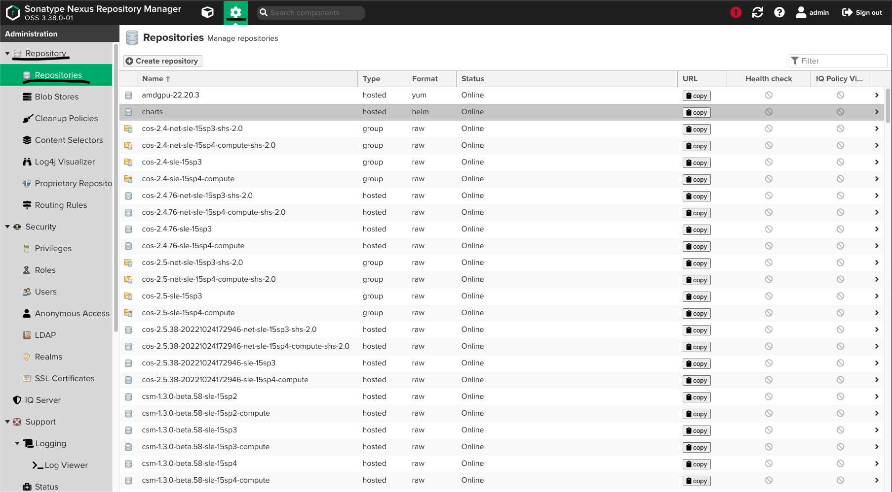
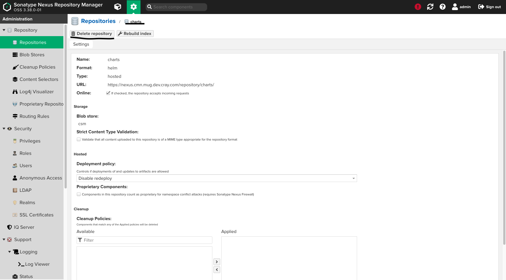
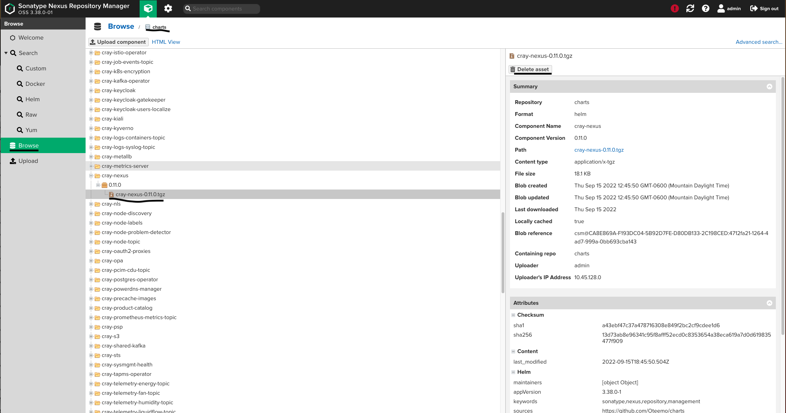
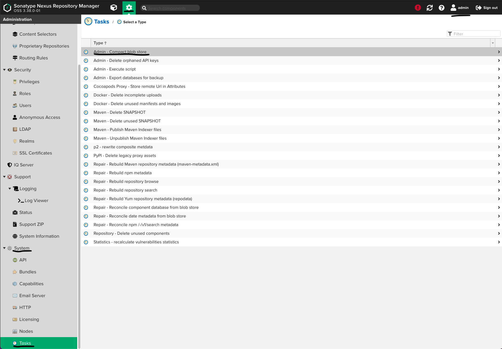
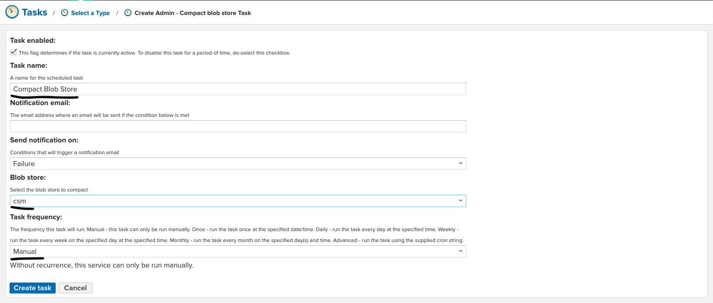

# Nexus Space Cleanup

Nexus stores all data in a PVC called `nexus-data`. If this PVC fills up, then it will enter a read-only state. This read-only state causes
issues for Nexus as well as all the services that rely on Nexus. There is no automatic cleanup of old data from Nexus.

During the install of any CSM version, a large amount data is added to Nexus. If there has not been a manual cleanup of old files in Nexus,
then there is likely to be insufficient space for the next version of CSM to be installed.

**NOTE:** The HPE Cray EX System Software 22.07 release has around 130 Gigabytes of space needed in Nexus.

This page outlines the procedure to manually cleanup Nexus, in order to ensure that there is sufficient free space for a CSM upgrade.

- [Cleanup of data not being used](#cleanup-of-data-not-being-used)
- [Cleanup of old installs](#cleanup-of-old-installs)
- [Remove data marked for deletion](#remove-data-marked-for-deletion)
- [Check PVC size](#check-pvc-size)
- [Increase PVC size](#increase-pvc-size)

## Cleanup of data not being used

Any data in Nexus that is not currently being used can be deleted to make space for the upgrade. Data includes repositories or artifacts.
To delete a blob store, refer to [Remove Data Marked For Deletion](#remove-data-marked-for-deletion). This can include data added after the
previous install, or data that was added during an install that is no longer needed. If there is anything in Nexus that is no longer needed,
then it is recommended to delete that first, before taking any further steps.

### Marking a repository for deletion

A repository can be deleted from the web UI or from the CLI.

To delete a repository from the CLI, reference
[Manage Repositories with Nexus](./Manage_Repositories_with_Nexus.md#delete-a-repository).

To delete a repository out of the web UI:

1. Refer to [Access Nexus with the Web UI](./Manage_Repositories_with_Nexus.md#access-nexus-with-the-web-ui).
1. Authenticate to the web UI.
1. Browse to the Nexus admin section.
1. Click on **Repository**.
1. Click on **Repositories**.

   

1. Select any repository to delete, where the **Type** is **hosted** and a new screen with a button that says
**Delete repository** should appear at the top. Clicking that button will mark the repository for deletion.

   

### Marking a artifact for deletion

An artifact can be easily deleted from the web UI. To delete an artifact from a repository:

1. Authenticate in the web UI.
1. Click on **Browse**.
1. Click on the repository you want to remove an asset from.
1. Click on the asset itself (either the folder, component, or asset).
1. Select delete on the right side menu.

  

## Cleanup of old installs

There is no documented list of files that are known to be older versions. If the system has been installed and around for
an extended period of time, or been put through multiple upgrades, then submit a help request in order to determine what can be safely deleted from Nexus.
Before submitting the help request, run a script to gather data about the system. This script outputs all of the blob stores and repositories in
Nexus, and a list of what blob store each repository point to.

The script can be run on any master NCN where the latest CSM documentation is installed. See
[Check for latest documentation](../../update_product_stream/README.md#check-for-latest-documentation).

(`ncn-m#`) Run the script as follows:

```bash
/usr/share/doc/csm/scripts/nexus-space-usage.sh
```

## Remove data marked for deletion

After something is deleted in Nexus, the data is marked for deletion but not removed from the disk. This can lead to a situation
where there is no space left on the disk but no way to see what is taking up space. After removing data from Nexus a clean up task needs
to be created to clear data from the disk. After data (a repository or just some artifacts) are deleted from Nexus create a task in Nexus
by going to the Nexus admin section then clicking on **System**, then **Tasks**. The task that should be created is called "Admin - Compact blob store".

  

The task has three required fields. A name, a blob store, and task frequency. The name can be anything as long as it is not the same as another task.
The blob store should be a blob store that has some data marked for deletion. The task frequency should be manual.

  

Once the task is created, then the task must be run. Click on the task name from the task list, then click on run. It should take anywhere from
30 seconds to 5 minutes depending on how much is marked for deletion. Check in the blob store section under repositories to make sure the total size
decreases. If the task takes zero seconds to run, then either no data is marked for deletion or the task needs to be run again. After the blob store has zero
total size the blob store can be deleted.

**NOTE:** If the task fails to run and never cleans any data, and the `nexus-data` PVC is completely full the PVC will need to be grown to run the task.

## Check PVC size

To check the amount of storage used, available, and total in the PVC.

(`ncn-m#`) Run the following command on a mater node:

```bash
kubectl exec -n nexus deploy/nexus -c nexus -- df -Ph /nexus-data | grep '/nexus-data' | awk '{print ("Used:", $3, "Available:", $4, "Total Size:", $2)}'
```

## Increase PVC size

If no other methods of cleaning work, then submit a help request to expand the `nexus-data` PVC. Expanding the PVC will allow the upgrade
to proceed. Expanding the PVC will also require future work to allow for further upgrades.

**CAUTION:** This is an irreversible step and is not recommended.
