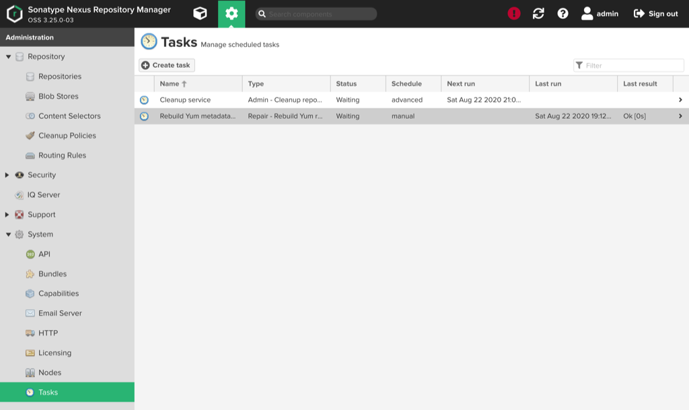
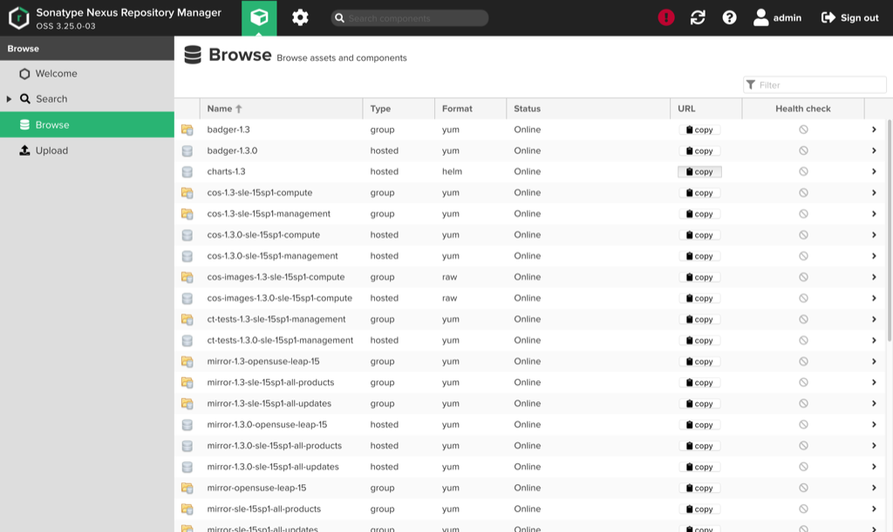

# Repair Yum Repository Metadata

Nexus may have trouble generating or regenerating repository metadata \(for example, `repodata/repomd.xml`\), especially for larger repositories.
Configure the `Repair - Rebuild Yum repository metadata (repodata)` task in Nexus to create the metadata if the standard generation fails.
This is not typically needed, so it is considered to be a repair task.

The example in this procedure is for creating a repair task to rebuild Yum metadata for the `mirror-1.4.0-opensuse-leap-15` repository.

See the [Nexus documentation on tasks](https://help.sonatype.com/repomanager3/system-configuration/tasks) for more information.

- [Prerequisites](#prerequisites)
- [System domain name](#system-domain-name)
- [Nexus web URL](#nexus-web-url)
- [Procedure](#procedure)
- [Troubleshooting](#troubleshooting)

## Prerequisites

CSM installation is complete.

## System domain name

The `SYSTEM_DOMAIN_NAME` value found in some of the URLs on this page is expected to be the system's fully qualified domain name (FQDN).

(`ncn-mw#`) The FQDN can be found by running the following command on any Kubernetes NCN.

```bash
kubectl get secret site-init -n loftsman -o jsonpath='{.data.customizations\.yaml}' | base64 -d | yq r - spec.network.dns.external
```

Example output:

```text
system..hpc.amslabs.hpecorp.net
```

Be sure to modify the example URLs on this page by replacing `SYSTEM_DOMAIN_NAME` with the actual value found using the above command.

## Nexus web URL

Nexus is accessible using a web browser at the following URL: `https://nexus.cmn.SYSTEM_DOMAIN_NAME`

An example of what the resulting URL will look like is: `https://nexus.cmn.eniac.dev.cray.com`.

## Procedure

1. Log in to the Nexus web UI.

    Users will need to log in through the Nexus UI. The account is configured through Keycloak with a role mapping for Nexus authentication.
    The role needed for administrative permissions is `nx-admin` in the `system-nexus-client` role.
    Scripts may connect by using a username and password in the request.

    

    

1. Click on the gear icon at the top of the page.

    Clicking on the gear will open up the repository administration page.

    

1. Click on `Tasks` in the navigation bar on the left-hand side of the page.

    The `Tasks` button is under the `System` heading.

    

1. Click the `Create Task` button.

    Clicking the `Create Task` button will open up the following page. Select the type of task. For this example, the `Create Repair - Rebuild Yum repository metadata (repodata)` option would be selected.

    

1. Enter the required information for the task, such as the task name, repository, and task frequency.

    Click the `Create task` at the bottom of the page after entering all required information about the task.

    

    The new task will now be available on the main `Tasks` page.

1. Click on the newly created task.

    

1. Click the `Run` button at the top of the page.

    

    Select `Yes` when the confirmation pop-up appears.

    

    There will now be information about the run that was just scheduled on the main `Tasks` page.

    

1. Click on the box icon in the navigation bar at the top of the page, then click `Browse` in the navigation bar on the left-hand side of the page.

    

1. Track down the name of the repository being repaired.

    In this example, `mirror-1.4.0-opensuse-leap-15` is used.

1. View the `repodata` for the repository.

    

    

1. (`ncn-mw#`) View the log file on the system.

    Even though the Nexus logs contains messages pertaining to tasks, it can be difficult to track messages for a specific task, especially because rebuilding Yum metadata takes a long time.

    1. Retrieve the Nexus pod name.

        ```bash
        kubectl -n nexus get pods | grep nexus
        ```

        Example output:

        ```text
        nexus-55d8c77547-65k6q              2/2     Running     1          22h
        ```

    1. Access the running Nexus pod.

        ```bash
        kubectl -n nexus exec -ti nexus-55d8c77547-65k6q -c nexus -- ls -ltr /nexus-data/log/tasks
        ```

        Example output:

        ```text
        total 8
        -rw-r--r-- 1 nexus nexus 1763 Aug 23 00:50 repository.yum.rebuild.metadata-20200822235306934.log
        -rw-r--r-- 1 nexus nexus 1525 Aug 23 01:00 repository.cleanup-20200823010000013.log
        ```

        If multiple repositories are being rebuilt, search the logs for the specific repository to find the latest corresponding log file. The example below is for `mirror-1.4.0-opensuse-leap-15`:

        ```bash
        kubectl -n nexus exec -ti nexus-55d8c77547-65k6q -c nexus -- grep -R 'Rebuilding yum metadata for repository mirror-1.4.0-opensuse-leap-15' /nexus-data/log/tasks
        ```

        Example output:

        ```text
        /nexus-data/log/tasks/repository.yum.rebuild.metadata-20200822235306934.log:2020-08-22 23:53:06,936+0000 INFO  [event-12-thread-797]  *SYSTEM org.sonatype.nexus.repository.yum.internal.createrepo.CreateRepoFacetImpl - Rebuilding yum metadata for repository mirror-1.4.0-opensuse-leap-15
        ```

    1. View the log file for the rebuild.

        The log file for a successful rebuild will look similar to the following:

        ```bash
        kubectl -n nexus exec -ti nexus-55d8c77547-65k6q -c nexus -- cat /nexus-data/log/tasks/repository.yum.rebuild.metadata-20200822235306934.log
        ```

        Example output:

        ```text
        2020-08-22 23:53:06,934+0000 INFO  [quartz-9-thread-20]  *SYSTEM org.sonatype.nexus.repository.yum.internal.createrepo.task.YumCreateRepoTask - Task information:
        2020-08-22 23:53:06,935+0000 INFO  [quartz-9-thread-20]  *SYSTEM org.sonatype.nexus.repository.yum.internal.createrepo.task.YumCreateRepoTask -  ID: 35536bcd-3947-4ba9-8d6d-43dcadbb87ad
        2020-08-22 23:53:06,935+0000 INFO  [quartz-9-thread-20]  *SYSTEM org.sonatype.nexus.repository.yum.internal.createrepo.task.YumCreateRepoTask -  Type: repository.yum.rebuild.metadata
        2020-08-22 23:53:06,935+0000 INFO  [quartz-9-thread-20]  *SYSTEM org.sonatype.nexus.repository.yum.internal.createrepo.task.YumCreateRepoTask -  Name: Rebuild Yum metadata - mirror-1.4.0-opensuse-leap-15
        2020-08-22 23:53:06,935+0000 INFO  [quartz-9-thread-20]  *SYSTEM org.sonatype.nexus.repository.yum.internal.createrepo.task.YumCreateRepoTask -  Description: Rebuild metadata for mirror-1.4.0-opensuse-leap-15
        2020-08-22 23:53:06,936+0000 INFO  [quartz-9-thread-20]  *SYSTEM org.sonatype.nexus.repository.yum.internal.createrepo.task.YumCreateRepoTask - Task log: /nexus-data/log/tasks/repository.yum.rebuild.metadata-20200822235306934.log
        2020-08-22 23:53:06,936+0000 INFO  [event-12-thread-797]  *SYSTEM org.sonatype.nexus.repository.yum.internal.createrepo.CreateRepoFacetImpl - Rebuilding yum metadata for repository mirror-1.4.0-opensuse-leap-15
        2020-08-22 23:53:06,936+0000 INFO  [quartz-9-thread-20]  *SYSTEM org.sonatype.nexus.repository.yum.internal.createrepo.task.YumCreateRepoTask - Task complete
        2020-08-23 00:50:47,468+0000 INFO  [event-12-thread-797]  *SYSTEM org.sonatype.nexus.repository.yum.internal.createrepo.CreateRepoFacetImpl - Finished rebuilding yum metadata for repository mirror-1.4.0-opensuse-leap-15
        ```

        The returned `Finished rebuilding yum metadata for repository` without any other `ERROR` or `WARN` messages indicates that the rebuild has completed successfully.

        In this case, it took nearly 58 minutes to finish. The time it takes to run is related to the size of the repository, so expect the `mirror-1.3.0-` repositories to take a while.

1. Check the `repodata` for the repository again in the web UI.

    

    

## Troubleshooting

When a rebuild fails, expect to see `ERROR` and `WARN` messages around the same time as the `Finished rebuilding yum metadata for repository` message.

(`ncn-mw#`) For example, consider the log from a failed rebuild of `mirror-1.4.0-opensuse-leap-15`:

```bash
kubectl -n nexus exec -ti nexus-55d8c77547-65k6q -c nexus -- cat /nexus-data/log/tasks/repository.yum.rebuild.metadata-20200822231259523.log
```

Example output:

```text
2020-08-22 23:12:59,523+0000 INFO  [quartz-9-thread-20]  *SYSTEM org.sonatype.nexus.repository.yum.internal.createrepo.task.YumCreateRepoTask - Task information:
2020-08-22 23:12:59,526+0000 INFO  [quartz-9-thread-20]  *SYSTEM org.sonatype.nexus.repository.yum.internal.createrepo.task.YumCreateRepoTask -  ID: 35536bcd-3947-4ba9-8d6d-43dcadbb87ad
2020-08-22 23:12:59,526+0000 INFO  [quartz-9-thread-20]  *SYSTEM org.sonatype.nexus.repository.yum.internal.createrepo.task.YumCreateRepoTask -  Type: repository.yum.rebuild.metadata
2020-08-22 23:12:59,526+0000 INFO  [quartz-9-thread-20]  *SYSTEM org.sonatype.nexus.repository.yum.internal.createrepo.task.YumCreateRepoTask -  Name: Rebuild Yum metadata - mirror-1.4.0-opensuse-leap-15
2020-08-22 23:12:59,527+0000 INFO  [quartz-9-thread-20]  *SYSTEM org.sonatype.nexus.repository.yum.internal.createrepo.task.YumCreateRepoTask -  Description: Rebuild metadata for mirror-1.4.0-opensuse-leap-15
2020-08-22 23:12:59,529+0000 INFO  [quartz-9-thread-20]  *SYSTEM org.sonatype.nexus.repository.yum.internal.createrepo.task.YumCreateRepoTask - Task log: /nexus-data/log/tasks/repository.yum.rebuild.metadata-20200822231259523.log
2020-08-22 23:12:59,529+0000 INFO  [event-12-thread-780]  *SYSTEM org.sonatype.nexus.repository.yum.internal.createrepo.CreateRepoFacetImpl - Rebuilding yum metadata for repository mirror-1.4.0-opensuse-leap-15
2020-08-22 23:12:59,531+0000 INFO  [quartz-9-thread-20]  *SYSTEM org.sonatype.nexus.repository.yum.internal.createrepo.task.YumCreateRepoTask - Task complete
2020-08-22 23:24:16,974+0000 INFO  [Thread-1948 <command>sql.select from asset where (component IS NOT NULL  AND attributes.yum.asset_kind = :p0) and (bucket=#59:1)</command>]  *SYSTEM com.orientechnologies.common.profiler.OProfilerStub - $ANSI{green {db=component}} [TIP] Query 'SELECT FROM asset WHERE (component IS NOT NULL AND attributes.yum.asset_kind = "RPM" ) AND (bucket = #59:1 )' returned a result set with more than 10000 records. Check if you really need all these records, or reduce the resultset by using a LIMIT to improve both performance and used RAM
2020-08-22 23:29:57,700+0000 INFO  [event-12-thread-780]  *SYSTEM org.sonatype.nexus.repository.yum.internal.createrepo.CreateRepoFacetImpl - Finished rebuilding yum metadata for repository mirror-1.4.0-opensuse-leap-15
2020-08-22 23:29:57,701+0000 ERROR [event-12-thread-780]  *SYSTEM com.google.common.eventbus.EventBus.nexus.async - Could not dispatch event org.sonatype.nexus.repository.yum.internal.createrepo.YumMetadataInvalidationEvent@75b487e7 to subscriber org.sonatype.nexus.repository.yum.internal.createrepo.CreateRepoFacetImpl$$EnhancerByGuice$$9db995@93053b8 method [public void org.sonatype.nexus.repository.yum.internal.createrepo.CreateRepoFacetImpl.on(org.sonatype.nexus.repository.yum.internal.createrepo.YumMetadataInvalidationEvent)]
org.sonatype.nexus.repository.InvalidContentException: Invalid RPM: external/noarch/redeclipse-data-1.5.6-lp151.2.5.noarch.rpm
    at org.sonatype.nexus.repository.yum.internal.rpm.YumRpmParser.parse(YumRpmParser.java:108)
    at org.sonatype.nexus.repository.yum.internal.rpm.YumRpmParser.parse(YumRpmParser.java:76)
    at org.sonatype.nexus.repository.yum.internal.createrepo.CreateRepoServiceImpl.writeAssetToMetadata(CreateRepoServiceImpl.java:651)
    at org.sonatype.nexus.repository.yum.internal.createrepo.CreateRepoServiceImpl.appendRpm(CreateRepoServiceImpl.java:511)
    at org.sonatype.nexus.repository.yum.internal.createrepo.CreateRepoServiceImpl.loopAllRpmsAndAppend(CreateRepoServiceImpl.java:499)
    at org.sonatype.nexus.repository.yum.internal.createrepo.CreateRepoServiceImpl.writeMetadata(CreateRepoServiceImpl.java:477)
    at org.sonatype.nexus.repository.yum.internal.createrepo.CreateRepoServiceImpl.convertDirectoriesToMetadata(CreateRepoServiceImpl.java:180)
    at org.sonatype.nexus.repository.yum.internal.createrepo.CreateRepoServiceImpl.buildMetadata(CreateRepoServiceImpl.java:150)
    at org.sonatype.nexus.repository.yum.internal.createrepo.CreateRepoServiceImpl.buildMetadata(CreateRepoServiceImpl.java:134)
    at org.sonatype.nexus.repository.yum.internal.createrepo.CreateRepoServiceImpl.buildMetadataWithoutCaching(CreateRepoServiceImpl.java:125)
    at org.sonatype.nexus.transaction.TransactionalWrapper.proceedWithTransaction(TransactionalWrapper.java:57)
    at org.sonatype.nexus.transaction.TransactionInterceptor.proceedWithTransaction(TransactionInterceptor.java:66)
    at org.sonatype.nexus.transaction.TransactionInterceptor.invoke(TransactionInterceptor.java:55)
    at org.sonatype.nexus.repository.yum.internal.createrepo.CreateRepoFacetImpl.buildMetadata(CreateRepoFacetImpl.java:196)
    at org.sonatype.nexus.repository.yum.internal.createrepo.CreateRepoFacetImpl.on(CreateRepoFacetImpl.java:178)
    at sun.reflect.GeneratedMethodAccessor125.invoke(Unknown Source)
    at sun.reflect.DelegatingMethodAccessorImpl.invoke(DelegatingMethodAccessorImpl.java:43)
    at java.lang.reflect.Method.invoke(Method.java:498)
    at com.google.common.eventbus.Subscriber.invokeSubscriberMethod(Subscriber.java:87)
    at com.google.common.eventbus.Subscriber$SynchronizedSubscriber.invokeSubscriberMethod(Subscriber.java:144)
    at com.google.common.eventbus.Subscriber$1.run(Subscriber.java:72)
    at org.sonatype.nexus.thread.internal.MDCAwareRunnable.run(MDCAwareRunnable.java:40)
    at org.apache.shiro.subject.support.SubjectRunnable.doRun(SubjectRunnable.java:120)
    at org.apache.shiro.subject.support.SubjectRunnable.run(SubjectRunnable.java:108)
    at java.util.concurrent.ThreadPoolExecutor.runWorker(ThreadPoolExecutor.java:1149)
    at java.util.concurrent.ThreadPoolExecutor$Worker.run(ThreadPoolExecutor.java:624)
    at java.lang.Thread.run(Thread.java:748)
Caused by: java.net.SocketTimeoutException: Read timed out
    at java.net.SocketInputStream.socketRead0(Native Method)
    at java.net.SocketInputStream.socketRead(SocketInputStream.java:116)
    at java.net.SocketInputStream.read(SocketInputStream.java:171)
    at java.net.SocketInputStream.read(SocketInputStream.java:141)
    at org.apache.http.impl.io.SessionInputBufferImpl.streamRead(SessionInputBufferImpl.java:137)
    at org.apache.http.impl.io.SessionInputBufferImpl.read(SessionInputBufferImpl.java:198)
    at org.apache.http.impl.io.ContentLengthInputStream.read(ContentLengthInputStream.java:176)
    at org.apache.http.conn.EofSensorInputStream.read(EofSensorInputStream.java:135)
    at com.amazonaws.internal.SdkFilterInputStream.read(SdkFilterInputStream.java:82)
    at com.amazonaws.event.ProgressInputStream.read(ProgressInputStream.java:180)
    at com.amazonaws.internal.SdkFilterInputStream.read(SdkFilterInputStream.java:82)
    at com.amazonaws.services.s3.internal.S3AbortableInputStream.read(S3AbortableInputStream.java:125)
    at com.amazonaws.internal.SdkFilterInputStream.read(SdkFilterInputStream.java:82)
    at com.amazonaws.internal.SdkFilterInputStream.read(SdkFilterInputStream.java:82)
    at com.amazonaws.internal.SdkFilterInputStream.read(SdkFilterInputStream.java:82)
    at com.amazonaws.event.ProgressInputStream.read(ProgressInputStream.java:180)
    at com.amazonaws.internal.SdkFilterInputStream.read(SdkFilterInputStream.java:82)
    at com.amazonaws.util.LengthCheckInputStream.read(LengthCheckInputStream.java:107)
    at com.amazonaws.internal.SdkFilterInputStream.read(SdkFilterInputStream.java:82)
    at java.io.BufferedInputStream.fill(BufferedInputStream.java:246)
    at java.io.BufferedInputStream.read1(BufferedInputStream.java:286)
    at java.io.BufferedInputStream.read(BufferedInputStream.java:345)
    at com.google.common.io.CountingInputStream.read(CountingInputStream.java:63)
    at java.security.DigestInputStream.read(DigestInputStream.java:161)
    at java.io.FilterInputStream.read(FilterInputStream.java:107)
    at com.google.common.io.ByteStreams.exhaust(ByteStreams.java:273)
    at org.sonatype.nexus.repository.yum.internal.rpm.YumRpmParser.parse(YumRpmParser.java:97)
    ... 26 common frames omitted
2020-08-22 23:30:06,427+0000 WARN  [Thread-1948 <command>sql.select from asset where (component IS NOT NULL  AND attributes.yum.asset_kind = :p0) and (bucket=#59:1)</command>]  *SYSTEM org.sonatype.nexus.repository.storage.OrientAsyncHelper$QueueFeedingResultListener - Timed out adding query result to queue 28dee0bf after 60 seconds, aborting query
2020-08-22 23:31:06,430+0000 WARN  [Thread-1948 <command>sql.select from asset where (component IS NOT NULL  AND attributes.yum.asset_kind = :p0) and (bucket=#59:1)</command>]  *SYSTEM org.sonatype.nexus.repository.storage.OrientAsyncHelper$QueueFeedingResultListener - Timed out adding end marker to queue 28dee0bf after 60 seconds
```

Any SQL warnings or notifications indicate the rebuild may have failed. Examine `repodata/*.xml.gz` file attributes, such as file size and last modified time,
to determine if they are new compared to the timestamp on the `Finished rebuilding yum metadata for repository` message.

```text
2020-08-22 23:24:16,974+0000 INFO  [Thread-1948 <command>sql.select from asset where (component IS NOT NULL  AND attributes.yum.asset_kind = :p0) and (bucket=#59:1)</command>]  *SYSTEM com.orientechnologies.common.profiler.OProfilerStub - $ANSI{green {db=component}} [TIP] Query 'SELECT FROM asset WHERE (component IS NOT NULL AND attributes.yum.asset_kind = "RPM" ) AND (bucket = #59:1 )' returned a result set with more than 10000 records. Check if you really need all these records, or reduce the resultset by using a LIMIT to improve both performance and used RAM
...
2020-08-22 23:30:06,427+0000 WARN  [Thread-1948 <command>sql.select from asset where (component IS NOT NULL  AND attributes.yum.asset_kind = :p0) and (bucket=#59:1)</command>]  *SYSTEM org.sonatype.nexus.repository.storage.OrientAsyncHelper$QueueFeedingResultListener - Timed out adding query result to queue 28dee0bf after 60 seconds, aborting query
2020-08-22 23:31:06,430+0000 WARN  [Thread-1948 <command>sql.select from asset where (component IS NOT NULL  AND attributes.yum.asset_kind = :p0) and (bucket=#59:1)</command>]  *SYSTEM org.sonatype.nexus.repository.storage.OrientAsyncHelper$QueueFeedingResultListener - Timed out adding end marker to queue 28dee0bf after 60 seconds
```

However, seeing an `ERROR` with a JVM stack trace is a key indication that the rebuild failed:

```text
2020-08-22 23:29:57,701+0000 ERROR [event-12-thread-780]  *SYSTEM com.google.common.eventbus.EventBus.nexus.async - Could not dispatch event org.sonatype.nexus.repository.yum.internal.createrepo.YumMetadataInvalidationEvent@75b487e7 to subscriber org.sonatype.nexus.repository.yum.internal.createrepo.CreateRepoFacetImpl$$EnhancerByGuice$$9db995@93053b8 method [public void org.sonatype.nexus.repository.yum.internal.createrepo.CreateRepoFacetImpl.on(org.sonatype.nexus.repository.yum.internal.createrepo.YumMetadataInvalidationEvent)]
org.sonatype.nexus.repository.InvalidContentException: Invalid RPM: external/noarch/redeclipse-data-1.5.6-lp151.2.5.noarch.rpm
    at org.sonatype.nexus.repository.yum.internal.rpm.YumRpmParser.parse(YumRpmParser.java:108)
    at org.sonatype.nexus.repository.yum.internal.rpm.YumRpmParser.parse(YumRpmParser.java:76)
    at org.sonatype.nexus.repository.yum.internal.createrepo.CreateRepoServiceImpl.writeAssetToMetadata(CreateRepoServiceImpl.java:651)
    at org.sonatype.nexus.repository.yum.internal.createrepo.CreateRepoServiceImpl.appendRpm(CreateRepoServiceImpl.java:511)
    at org.sonatype.nexus.repository.yum.internal.createrepo.CreateRepoServiceImpl.loopAllRpmsAndAppend(CreateRepoServiceImpl.java:499)
    at org.sonatype.nexus.repository.yum.internal.createrepo.CreateRepoServiceImpl.writeMetadata(CreateRepoServiceImpl.java:477)
    at org.sonatype.nexus.repository.yum.internal.createrepo.CreateRepoServiceImpl.convertDirectoriesToMetadata(CreateRepoServiceImpl.java:180)
    at org.sonatype.nexus.repository.yum.internal.createrepo.CreateRepoServiceImpl.buildMetadata(CreateRepoServiceImpl.java:150)
    at org.sonatype.nexus.repository.yum.internal.createrepo.CreateRepoServiceImpl.buildMetadata(CreateRepoServiceImpl.java:134)
    at org.sonatype.nexus.repository.yum.internal.createrepo.CreateRepoServiceImpl.buildMetadataWithoutCaching(CreateRepoServiceImpl.java:125)
    at org.sonatype.nexus.transaction.TransactionalWrapper.proceedWithTransaction(TransactionalWrapper.java:57)
    at org.sonatype.nexus.transaction.TransactionInterceptor.proceedWithTransaction(TransactionInterceptor.java:66)
    at org.sonatype.nexus.transaction.TransactionInterceptor.invoke(TransactionInterceptor.java:55)
    at org.sonatype.nexus.repository.yum.internal.createrepo.CreateRepoFacetImpl.buildMetadata(CreateRepoFacetImpl.java:196)
    at org.sonatype.nexus.repository.yum.internal.createrepo.CreateRepoFacetImpl.on(CreateRepoFacetImpl.java:178)
    at sun.reflect.GeneratedMethodAccessor125.invoke(Unknown Source)
    at sun.reflect.DelegatingMethodAccessorImpl.invoke(DelegatingMethodAccessorImpl.java:43)
    at java.lang.reflect.Method.invoke(Method.java:498)
    at com.google.common.eventbus.Subscriber.invokeSubscriberMethod(Subscriber.java:87)
    at com.google.common.eventbus.Subscriber$SynchronizedSubscriber.invokeSubscriberMethod(Subscriber.java:144)
    at com.google.common.eventbus.Subscriber$1.run(Subscriber.java:72)
    at org.sonatype.nexus.thread.internal.MDCAwareRunnable.run(MDCAwareRunnable.java:40)
    at org.apache.shiro.subject.support.SubjectRunnable.doRun(SubjectRunnable.java:120)
    at org.apache.shiro.subject.support.SubjectRunnable.run(SubjectRunnable.java:108)
    at java.util.concurrent.ThreadPoolExecutor.runWorker(ThreadPoolExecutor.java:1149)
    at java.util.concurrent.ThreadPoolExecutor$Worker.run(ThreadPoolExecutor.java:624)
    at java.lang.Thread.run(Thread.java:748)
Caused by: java.net.SocketTimeoutException: Read timed out
    at java.net.SocketInputStream.socketRead0(Native Method)
    at java.net.SocketInputStream.socketRead(SocketInputStream.java:116)
    at java.net.SocketInputStream.read(SocketInputStream.java:171)
    at java.net.SocketInputStream.read(SocketInputStream.java:141)
    at org.apache.http.impl.io.SessionInputBufferImpl.streamRead(SessionInputBufferImpl.java:137)
    at org.apache.http.impl.io.SessionInputBufferImpl.read(SessionInputBufferImpl.java:198)
    at org.apache.http.impl.io.ContentLengthInputStream.read(ContentLengthInputStream.java:176)
    at org.apache.http.conn.EofSensorInputStream.read(EofSensorInputStream.java:135)
    at com.amazonaws.internal.SdkFilterInputStream.read(SdkFilterInputStream.java:82)
    at com.amazonaws.event.ProgressInputStream.read(ProgressInputStream.java:180)
    at com.amazonaws.internal.SdkFilterInputStream.read(SdkFilterInputStream.java:82)
    at com.amazonaws.services.s3.internal.S3AbortableInputStream.read(S3AbortableInputStream.java:125)
    at com.amazonaws.internal.SdkFilterInputStream.read(SdkFilterInputStream.java:82)
    at com.amazonaws.internal.SdkFilterInputStream.read(SdkFilterInputStream.java:82)
    at com.amazonaws.internal.SdkFilterInputStream.read(SdkFilterInputStream.java:82)
    at com.amazonaws.event.ProgressInputStream.read(ProgressInputStream.java:180)
    at com.amazonaws.internal.SdkFilterInputStream.read(SdkFilterInputStream.java:82)
    at com.amazonaws.util.LengthCheckInputStream.read(LengthCheckInputStream.java:107)
    at com.amazonaws.internal.SdkFilterInputStream.read(SdkFilterInputStream.java:82)
    at java.io.BufferedInputStream.fill(BufferedInputStream.java:246)
    at java.io.BufferedInputStream.read1(BufferedInputStream.java:286)
    at java.io.BufferedInputStream.read(BufferedInputStream.java:345)
    at com.google.common.io.CountingInputStream.read(CountingInputStream.java:63)
    at java.security.DigestInputStream.read(DigestInputStream.java:161)
    at java.io.FilterInputStream.read(FilterInputStream.java:107)
    at com.google.common.io.ByteStreams.exhaust(ByteStreams.java:273)
    at org.sonatype.nexus.repository.yum.internal.rpm.YumRpmParser.parse(YumRpmParser.java:97)
    ... 26 common frames omitted
```
