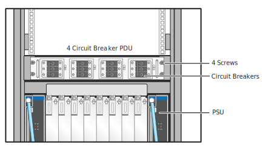

# Power Off Compute Cabinets

Power off HPE Cray EX liquid-cooled and standard racks.

## Cabinet/rack types

### Liquid-cooled cabinets

HPE Cray EX liquid-cooled cabinet CDU and PDU circuit breakers are controlled manually.

When the PDU breakers are switched to `OFF`, the Chassis Management Modules \(CMMs\) and Cabinet Environmental Controllers \(CECs\) are also powered off.

**Warning:** The cabinet 480VAC power bus bars remain energized. Facility power must be disconnected to completely remove power from the cabinet. Follow `lockout-tagout` procedures for the site before maintenance.

### Standard racks

HPE Cray standard EIA racks typically include two redundant PDUs. Some PDU models may require a flat-blade screwdriver to open or close the PDU circuit breakers.

**Warning:** The cabinet PDUs remain energized when circuit breakers are `OFF`. Facility power must be disconnected or the PDUs must be unplugged to completely remove power from the rack. Follow
`lockout-tagout` procedures for the site before maintenance.

## Prerequisites

* An authentication token is required to access the API gateway and to use the `sat` command. See the "SAT Authentication" section of the HPE Cray EX System Admin Toolkit (SAT) product stream
  documentation (`S-8031`) for instructions on how to acquire a SAT authentication token.
* This procedure assumes all system software and user jobs were shut down. See
  [Shut Down and Power Off Compute and User Access Nodes (UAN)](../Shut_Down_and_Power_Off_Compute_and_User_Access_Nodes.md).

## Procedure

If the system does not include HPE Cray EX liquid-cooled cabinets, then skip the next section and proceed to
[Power off standard rack PDU circuit breakers](#power-off-standard-rack-pdu-circuit-breakers).

### Power off HPE Cray EX liquid-cooled cabinets

1. Check CDU control panel for alerts or warnings and resolve any issues before continuing.

1. (`ncn-m#`) Check the power status before shutdown.

    This example shows cabinets 1000-1003.

    ```bash
    cray power status list --xnames "x[1000-1003]c[0-7]" --format json
    ```

1. (`ncn-m#`) Shut down services and power off liquid-cooled cabinets.

    ```bash
    sat bootsys shutdown --stage cabinet-power
    ```

    This command suspends the `hms-discovery` cron job and recursively powers off the liquid-cooled cabinet chassis.

    The `sat bootsys shutdown` command may fail to power off some cabinets and indicate that requests to PCS have timed out. In this case, the `sat` command may be run with an increased `--api-timeout` option:

    ```bash
    sat --api-timeout 180 bootsys shutdown --stage cabinet-power
    ```

1. (`ncn-m#`) Verify that the `hms-discovery` cron job has been suspended.

    If that is the case, then the `SUSPEND` column should be `True` in the output of the following command:

    ```bash
    kubectl get cronjobs -n services hms-discovery
    ```

    Example output:

    ```text
    NAME            SCHEDULE      SUSPEND   ACTIVE   LAST SCHEDULE   AGE^M
    hms-discovery   */3 * * * *   True      0        117s            15d
    ```

1. (`ncn-m#`) Check the power off status.

    This example shows cabinets 1000-1003.

    ```bash
    cray power status list --xnames "x[1000-1003]c[0-7]" --format json
    ```

    Rectifiers \(PSUs\) should indicate that DC power is `OFF` \(`AC OK` means the power is on\).

1. Set the cabinet PDU circuit breakers to `OFF` for each shelf.

    The `AC OK` LED on each PSU will remain amber for about 30 seconds \(`AC lost`\) until the system de-energizes, then it will extinguish.

    

    **`NOTE`** If the TDS cabinet rack-mounted coolant distribution unit \(MCDU\) is receiving power from the PDUs in the management cabinet, then the MCDU may stay on after the TDS cabinet PDU
    circuit breakers are set to `OFF`. This is expected.

    

    **CAUTION:** Do not power off the CDU if it is actively cooling other equipment.

1. If other systems are **not** being cooled by the floor-standing CDU, then open the CDU rear door to access the control panel and set the circuit breakers to `OFF`.

    

### Power off standard rack PDU circuit breakers

1. (`ncn-m#`) Check the power status before shutdown.

    This example shows nodes in cabinets 3001 - 3003.

    ```bash
    cray power status list --xnames "x300[1-3]c0s[1,3,5,7,9,11,13,15,17,19,21,23,25,27,29,31,33,35]b[1-4]n0" --format json
    ```

    In this example, the system includes only 2U servers and there are no state manager entries for even-numbered U-positions \(slots\); those would return an error.

    Example output:

    ```json
    {
      "status": [
        {
          "xname": "x3001c0s1b1n0",
          "powerState": "on",
          "managementState": "available",
          "error": "",
          "supportedPowerTransitions": [
            "On",
            "Soft-Off",
            "Off",
            "Soft-Restart",
            "Force-Off",
            "Init",
            "Hard-Restart"
          ],
          "lastUpdated": "2023-02-08T23:19:31.182851004Z"
        },
        {
          "xname": "x3003c0s19b1n0",
          "powerState": "off",
          "managementState": "available",
          "error": "",
          "supportedPowerTransitions": [
            "On",
            "Soft-Off",
            "Off",
            "Soft-Restart",
            "Force-Off",
            "Init",
            "Hard-Restart"
          ],
          "lastUpdated": "2023-02-08T23:19:31.18712898Z"
        },
        ...
      ]
    }
    ```

1. (`ncn-m#`) Use PCS to power off HPE Cray standard racks for **non-management** nodes.

    **CAUTION: Do not power off the management cabinet**. Verify that the components names \(xnames\) specified in the following command line do not accidentally power off management cabinets.

    This example shuts down racks 3001 - 3003.

    ```bash
    cray power transition off --xnames "x300[1-3]c0s[1,3,5,7,9,11,13,15,17,19,21,23,25,27,29,31,33,35]b[1-4]n0" --format json
    ```

1. (`ncn-m#`) Check the status of the PCS power off command and affected components.

    ```bash
    cray power transition describe 6e495247-73b6-44d0-8059-df47b650f1f8 --format json
    cray power status list --xnames "x300[1-3]c0s[1,3,5,7,9,11,13,15,17,19,21,23,25,27,29,31,33,35]b[1-4]n0" --format json
    ```

1. Set each cabinet PDU circuit breaker to `OFF`.

    A slotted screwdriver may be required to open PDU circuit breakers.

1. To power off Motivair liquid-cooled chilled doors and CDUs, locate the power off switch on the CDU control panel and set it to `OFF`.

    Refer to vendor documentation for the chilled-door cooling system for power control procedures when chilled doors are installed on standard racks.

## Next step

Return to [System Power Off Procedures](../System_Power_Off_Procedures.md) and continue with next step.
