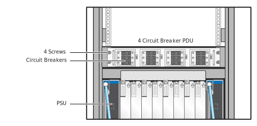

# Power Off Compute Cabinets

Power off HPE Cray EX liquid-cooled cabinets and managed nodes in standard racks. This procedure does not power off management nodes.

## Cabinet/rack types

### Liquid-cooled cabinets

HPE Cray EX liquid-cooled cabinet CDU and PDU circuit breakers are controlled manually.

When the PDU breakers are switched to `OFF`, the Chassis Management Modules \(CMMs\) and Cabinet Environmental Controllers \(CECs\) are also powered off.

**Warning:** The cabinet 480VAC power bus bars remain energized. Facility power must be disconnected to completely remove power from the cabinet. Follow `lockout-tagout` procedures for the site before maintenance.

### Standard racks

HPE Cray standard EIA racks typically include two redundant PDUs. Some PDU models may require a flat-blade screwdriver to open or close the PDU circuit breakers.

**Warning:** The cabinet PDUs remain energized when circuit breakers are `OFF`. Facility power must be disconnected or the PDUs must be unplugged to completely remove power from the rack. Follow
`lockout-tagout` procedures for the site before maintenance.

## Prerequisites

* An authentication token is required to access the API gateway and to use the `sat` command. See the "SAT Authentication" section of the HPE Cray EX System Admin Toolkit (SAT) product stream
  documentation (`S-8031`) for instructions on how to acquire a SAT authentication token.
* This procedure assumes all system software and user jobs were shut down. See
  [Shut Down and Power Off Managed Nodes](Shut_Down_and_Power_Off_Managed_Nodes.md).

## Procedure

### Check power status before shutdown

1. Check CDU control panel for alerts or warnings and resolve any issues before continuing.

   If coolant levels are on the verge of being too low, there may be a fault upon power up due to not enough coolant.

1. (`ncn-m#`) Check the power status for liquid-cooled cabinets before shutdown.

    Either use `sat status` or `cray power` to check. The `State` should be `On` for every Chassis.

    1. (`ncn-m001#`) Check the power status for every liquid-cooled cabinet Chassis.

       ```bash
       sat status --types Chassis
       ```

       Example output:

       ```text
       +---------+---------+-------+------+---------+------+----------+----------+
       | xname   | Type    | State | Flag | Enabled | Arch | Class    | Net Type |
       +---------+---------+-------+------+---------+------+----------+----------+
       | x1020c0 | Chassis | On    | OK   | True    | X86  | Mountain | Sling    |
       | x1020c1 | Chassis | On    | OK   | True    | X86  | Mountain | Sling    |
       | x1020c2 | Chassis | On    | OK   | True    | X86  | Mountain | Sling    |
       | x1020c3 | Chassis | On    | OK   | True    | X86  | Mountain | Sling    |
       | x1020c4 | Chassis | On    | OK   | True    | X86  | Mountain | Sling    |
       | x1020c5 | Chassis | On    | OK   | True    | X86  | Mountain | Sling    |
       | x1020c6 | Chassis | On    | OK   | True    | X86  | Mountain | Sling    |
       | x1020c7 | Chassis | On    | OK   | True    | X86  | Mountain | Sling    |
       ...
       +---------+---------+-------+------+---------+------+----------+----------+
       ```

    1. (`ncn-m001#`) Check the power status with PCS.

        This example shows liquid-cooled cabinets 1000 - 1003.

        ```bash
        cray power status list --xnames x[1000-1003]c[0-7] --format json
        ```

        Example output:

        ```json
        {
          "status": [
            {
              "xname": "x1000c0",
              "powerState": "on",
              "managementState": "available",
              "error": "",
              "supportedPowerTransitions": [
                "Force-Off",
                "Soft-Off",
                "Off",
                "On",
                "Init",
                "Hard-Restart",
                "Soft-Restart"
              ],
              "lastUpdated": "2024-09-28T12:35:05.267949294Z"
            },
            {
              "xname": "x1000c1",
              "powerState": "on",
              "managementState": "available",
              "error": "",
              "supportedPowerTransitions": [
                "Soft-Off",
                "Off",
                "On",
                "Force-Off",
                "Init",
                "Hard-Restart",
                "Soft-Restart"
              ],
              "lastUpdated": "2024-09-28T12:35:05.187416764Z"
            },
       [...]
       ```

1. (`ncn-m#`) Check the power status for nodes in the standard racks before shutdown.

    Either use `sat status` or `cray power` to check. The `State` should be `Off` for every node.

    1. (`ncn-m001#`) Check the power status for every `River` node which is not a management node.

       ```bash
       sat status --filter class=river --filter role!=management --filter enabled=true --hsm-fields
       ```

       Example output:

       ```text
       +----------------+------+----------+---------+-------+---------+------+-------+-------------+------------+----------+
       | xname          | Type | NID      | State   | Flag  | Enabled | Arch | Class | Role        | SubRole    | Net Type |
       +----------------+------+----------+---------+-------+---------+------+-------+-------------+------------+----------+
       | x3000c0s14b0n0 | Node | 49168832 | Off     | OK    | True    | X86  | River | Application | UAN        | Sling    |
       | x3000c0s16b0n0 | Node | 49168896 | Off     | OK    | True    | X86  | River | Application | LNETRouter | Sling    |
       | x3000c0s18b0n0 | Node | 49168960 | Off     | OK    | True    | X86  | River | Application | LNETRouter | Sling    |
       | x3000c0s20b1n0 | Node | 1        | Off     | OK    | True    | X86  | River | Compute     | None       | Sling    |
       | x3000c0s20b2n0 | Node | 2        | Off     | OK    | True    | X86  | River | Compute     | None       | Sling    |
       | x3000c0s20b3n0 | Node | 3        | Off     | OK    | True    | X86  | River | Compute     | None       | Sling    |
       | x3000c0s20b4n0 | Node | 4        | Off     | OK    | True    | X86  | River | Compute     | None       | Sling    |
       ...
       +----------------+------+----------+---------+-------+---------+------+-------+-------------+------------+----------+
       ```

    1. (`ncn-m001#`) Check the power status with PCS.

       This example shows nodes in cabinets 3001 - 3003.

       The `cray power status` command requires that the list of components be explicitly listed. In this example, the system includes only 2U servers and there are no state manager entries for even-numbered U-positions \(slots\); those would return an error.

       ```bash
       cray power status list --xnames x300[1-3]c0s[1,3,5,7,9,11,13,15,17,19,21,23,25,27,29,31,33,35]b[1-4]n0 --format json
       ```

       Example output:

       ```json
       {
         "status": [
           {
             "xname": "x3001c0s1b0n0",
             "powerState": "undefined",
             "managementState": "unavailable",
             "error": "",
             "supportedPowerTransitions": [
               "Soft-Off",
               "Off",
               "On",
               "Force-Off",
               "Soft-Restart",
               "Init",
               "Hard-Restart"
             ],
             "lastUpdated": "2024-09-19T07:55:01.518324667Z"
           },
           {
             "xname": "x3001c0s3b0n0",
             "powerState": "on",
             "managementState": "available",
             "error": "",
             "supportedPowerTransitions": [
               "On",
               "Force-Off",
               "Soft-Off",
               "Off",
               "Soft-Restart",
               "Init",
               "Hard-Restart"
             ],
             "lastUpdated": "2024-10-02T05:02:38.945889134Z"
           },
           {
             "xname": "x3000c0s5b0n0",
             "powerState": "",
             "managementState": "",
             "error": "Component not found in component map.",
             "supportedPowerTransitions": null,
             "lastUpdated": ""
           },

       [...]
       ```

       The command does not filter nonexistent component names \(xnames\) and
       displays an error for each invalid component names specified. Use `cray power status list`
       with no `--xnames` option to show everything.

       ```bash
       cray power status list --format json
       ```

### Shut down cabinet power

The `sat bootsys shutdown --stage cabinet-power` command suspends the `hms-discovery` cron job, recursively powers off all
liquid-cooled cabinet chassis, compute modules, and router modules, then powers off non-management nodes in the air-cooled racks.

1. (`ncn-m#`) Shut down cabinet power.

    **Important:** The default timeout for the call to PCS is 120 seconds. If the `sat bootsys shutdown` command fails
    to power off some cabinets and indicate that requests to PCS have timed out, the `sat` command may be run with an increased `--pcs-timeout` value.

    ```bash
    sat bootsys shutdown --stage cabinet-power --pcs-timeout 240
    ```

1. (`ncn-m#`) Verify that the `hms-discovery` cron job has been suspended.

    If it has been suspended, then the `SUSPEND` column should be `True` in the output of the following command:

    ```bash
    kubectl get cronjobs -n services hms-discovery
    ```

    Example output:

    ```text
    NAME            SCHEDULE      SUSPEND   ACTIVE   LAST SCHEDULE   AGE^M
    hms-discovery   */3 * * * *   True      0        117s            15d
    ```

1. (`ncn-m#`) Check the power status for liquid-cooled cabinets after shutdown.

    Either use `sat status` or `cray power` to check. The `State` should be `Off` for every Chassis.

    1. (`ncn-m001#`) Check the power status for every liquid-cooled cabinet Chassis.

       ```bash
       sat status --types Chassis
       ```

       Example output:

       ```text
       +---------+---------+-------+------+---------+------+----------+----------+
       | xname   | Type    | State | Flag | Enabled | Arch | Class    | Net Type |
       +---------+---------+-------+------+---------+------+----------+----------+
       | x1020c0 | Chassis | Off   | OK   | True    | X86  | Mountain | Sling    |
       | x1020c1 | Chassis | Off   | OK   | True    | X86  | Mountain | Sling    |
       | x1020c2 | Chassis | Off   | OK   | True    | X86  | Mountain | Sling    |
       | x1020c3 | Chassis | Off   | OK   | True    | X86  | Mountain | Sling    |
       | x1020c4 | Chassis | Off   | OK   | True    | X86  | Mountain | Sling    |
       | x1020c5 | Chassis | Off   | OK   | True    | X86  | Mountain | Sling    |
       | x1020c6 | Chassis | Off   | OK   | True    | X86  | Mountain | Sling    |
       | x1020c7 | Chassis | Off   | OK   | True    | X86  | Mountain | Sling    |
       ...
       +---------+---------+-------+------+---------+------+----------+----------+
       ```

    1. (`ncn-m001#`) Check the power status with PCS.

       This example shows cabinets 1000 - 1003.

       ```bash
       cray power status list --xnames x[1000-1003]c[0-7] --format json
       ```

1. Rectifiers \(PSUs\) in the liquid-cooled cabinets should indicate that DC power is `OFF` \(`AC OK` means the power is on\).

1. (`ncn-m#`) Check the power status for nodes in the standard racks after shutdown.

    ```bash
    cray power status list --xnames x300[1-3]c0s[1,3,5,7,9,11,13,15,17,19,21,23,25,27,29,31,33,35]b[1-4]n0 --format json
    ```

### Power off liquid-cooled cabinet PDU circuit breakers

1. Set the cabinet PDU circuit breakers to `OFF` for each shelf.

    The `AC OK` LED on each PSU will remain amber for about 30 seconds \(`AC lost`\) until the system de-energizes, then it will extinguish.

    

    **`NOTE`** If the TDS cabinet rack-mounted coolant distribution unit \(MCDU\) is receiving power from the PDUs in the management cabinet, then the MCDU may stay on after the TDS cabinet PDU
    circuit breakers are set to `OFF`. This is expected.

    

    **CAUTION:** Do not power off the CDU if it is actively cooling other equipment.

1. If other systems are **not** being cooled by the floor-standing CDU, then open the CDU rear door to access the control panel and set the circuit breakers to `OFF`.

    

### Power off standard rack PDU circuit breakers

**CAUTION:** If any of the external Lustre or Spectrum Scale (GPFS) file systems are in air-cooled cabinets shared with air-cooled
compute nodes or management nodes, then the power off of the PDU circuits in these cabinets should be delayed until the external
file systems have been confirmed to be cleanly shut down. See the procedures in [Power Off the External File Systems](System_Power_Off_Procedures.md#Power_off_the_External_File_systems).

1. Set each cabinet PDU circuit breaker to `OFF`.

    A slotted screwdriver may be required to open PDU circuit breakers.

1. To power off Motivair liquid-cooled chilled doors and CDUs, locate the power off switch on the CDU control panel and set it to `OFF`.

    Refer to vendor documentation for the chilled-door cooling system for power control procedures when chilled doors are installed on standard racks.

## Next step

Return to [System Power Off Procedures](System_Power_Off_Procedures.md) and continue with next step.
