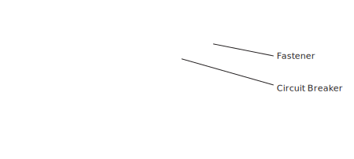

## Power Off Compute and IO Cabinets

Power off HPE Cray EX liquid-cooled and standard racks.

An authentication token is required to access the API gateway. See the *System Security and Authentication* section of the *HPE Cray EX System Administration Guide S-8001* for more information.

This procedure assumes all system software and user jobs were shut down using the *Shut Down and Power Off Compute and User Access Nodes \(UAN\).* procedure.

**Liquid-cooled Cabinets** - HPE Cray EX liquid-cooled cabinet CDU and PDU circuit breakers are controlled manually.

When the PDU breakers are switched to OFF, the Chassis Management Modules \(CMMs\) and Cabinet Environmental Controllers \(CECs\) are also powered off.

**Warning:** The cabinet 480VAC power bus bars remain energized. Facility power must be disconnected to completely remove power from the cabinet. Follow lockout-tagout procedures for the site before maintenance.

**Standard Racks** - HPE Cray standard EIA racks typically include 2 redundant PDUs. Some PDU models may require a flat-blade screw driver to open or close the PDU circuit breakers.

**Warning:** The cabinet PDUs remain energized when circuit breakers are OFF. Facility power must be disconnected or the PDUs must be unplugged to completely remove power from the rack. Follow lockout-tagout procedures for the site before maintenance.

1. If the system does not include Cray EX liquid-cooled cabinets, proceed to step 9.
   

   **POWER OFF CRAY EX LIQUID-COOLED CABINETS**

3.  Check CDU control panel for alerts or warnings and resolve any issues before continuing.

4.  Check the power status before shutdown, this example shows cabinets 1000-1003.

    ```screen
    ncn-m001# cray capmc get\_xname\_status create --xnames x\[1000-1003\]c\[0-7\] --format json
    ```

5.  Use `sat bootsys shutdown` to shutdown services and power off liquid-cooled cabinets.

    ```screen
    ncn-m001# sat bootsys shutdown --stage cabinet-power
    ```

    This command suspends the hms-discovery cron job and recursively powers off the liquid-cooled cabinet chassis.

6.  Verify that the hms-discovery cron job has been suspended \(`SUSPEND` column = true\).

    ```screen
    ncn-m001# kubectl get cronjobs -n services hms-discovery
    NAME            SCHEDULE      SUSPEND   ACTIVE   LAST SCHEDULE   AGE^M
    hms-discovery   */3 * * * *   True      0        117s            15d
    ```

7.  Check the power off status, this example shows cabinets 1000-1003.

    ```screen
    ncn-m001# cray capmc get\_xname\_status create --xnames x\[1000-1003\]c\[0-7\] --format json
    ```

    Rectifiers \(PSUs\) should indicate that DC power is OFF \(AC OK is on\).

8.  Set the cabinet PDU circuit breakers to OFF for each shelf.

    The AC OK LED on each PSU will remain amber for about 30 seconds \(AC lost\) until the system de-energizes, then extinguish.

    

    **Note:** If the TDS cabinet rack-mounted coolant distribution unit \(MCDU\) is receiving power from the PDUs in the management cabinet, the MCDU may stay on after the TDS cabinet PDU circuit breakers are set to OFF. This is expected.

    

    **CAUTION:** Do not power off the CDU if it is actively cooling other equipment.

9.  If other systems are **not** being cooled by the floor-standing CDU, open the CDU rear door to access the control panel and set the circuit breakers to OFF.

    

10. |POWER OFF STANDARD RACK PDU CIRCUIT BREAKERS|

11. Use CAPMC to power off HPE Cray standard racks.

    CAUTION: **Do not power off the management cabinet**. Verify the components names \(xnames\) specified in the following command line do not accidentally power off management cabinets.

    This example shuts down racks 3001-3003.

    ```screen
    ncn-m001# cray capmc xname\_off create --xnames x\[3001-3003\] --recursive true --format json
    ```

12. Check the status of the CAPMC power off command.

    ```screen
    ncn-m001# cray capmc get_xname_status create --xnames \\
    x300\[1-3\]c0s\[1,3,5,7,9,11,13,15,17,19,21,23,25,27,29,31,33,35\]b\[1-4\]n0 --format json
    ```

    The `get\_xname\_status` command requires that the list of components be explicitly listed. In this example, the system includes only 2U servers and there are no state manager entries for even-numbered U-positions \(slots\), which would return an error.

    The command does not filter nonexistent component names \(xnames\) and displays an error when invalid component names are specified. Use `--filter` `show\_all` option to filter all the output:

    ```screen
    ncn-m001# cray capmc get\_xname\_status create --filter show\_all
    \{
      "e": 0,
      "err_msg": "",
      "off": \[
        "x3000c0s19b0n0",
        "x3000c0s20b0n0",
        "x3000c0s22b0n0",
        "x3000c0s24b0n0",
        "x3000c0s27b1n0",
        "x3000c0s27b2n0",
        "x3000c0s27b3n0",
        "x3000c0s27b4n0"
      \],
      "on": \[
        "x3000c0r15e0",
        "x3000c0s2b0n0",
        "x3000c0s3b0n0",
        "x3000c0s4b0n0",
        "x3000c0s5b0n0",
        "x3000c0s6b0n0",
        "x3000c0s7b0n0",
        "x3000c0s8b0n0",
        "x3000c0s9b0n0"
      \]
    \}
    ```

13. Set each cabinet PDU circuit breaker to off.

    A slotted screw driver may be required to open PDU circuit breakers.

14. To power off Motivair liquid-cooled chilled doors and CDU, locate the power off switch on the CDU control panel and set it to OFF as shown in step 8.

    Refer to vendor documentation for the chilled-door cooling system for power control procedures when chilled doors are installed on standard racks.


