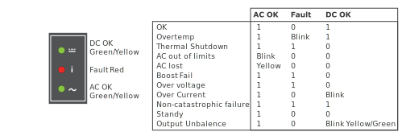

# Power On Compute Cabinets

Power on liquid-cooled and standard rack cabinet PDUs.

**Liquid-cooled Cabinets** - HPE Cray EX liquid-cooled cabinet CDU and PDU circuit breakers are controlled manually.

After the CDU is switched on and healthy, the liquid-cooled PDU circuit breakers can be switched ON. With PDU breakers ON, the Chassis Management Modules \(CMM\) and Cabinet Environmental Controllers \(CEC\) power on and boot.
These devices can then communicate with the management cluster and larger system management network. HVDC power remains OFF on liquid-cooled chassis until environmental conditions are normal and the CMMs receive a chassis
power-on command from Cray System Management \(CSM\) software.

**Standard Racks** - HPE Cray standard EIA racks include redundant PDUs. Some PDU models may require a flat-blade screw driver to open or close the PDU circuit breakers.

## Prerequisites

* The cabinet PDUs and coolant distribution units are connected to facility power and are healthy.
* An authentication token is required to access the API gateway and to use the `sat` command. See
  the "SAT Authentication" section of the HPE Cray EX System Admin Toolkit (SAT) product stream documentation (`S-8031`) for
  instructions on how to acquire a SAT authentication token.

## Procedure

1. Verify with site management that it is safe to power on the system.

1. If the system does not have Cray EX liquid-cooled cabinets, proceed to [Power On Standard Rack PDU Circuit Breakers](#power-on-standard-rack-pdu-circuit-breakers).

### Power On Cray Ex Liquid-Cooled Cabinet Circuit Breakers

1. Power on the CDU for the cabinet cooling group.

   1. Open the rear door of the CDU.

   1. Set the control panel circuit breakers to ON.

      

1. Set the PDU circuit breakers to on in each Cray EX cabinet.

   

1. Verify the status LEDs on the PSU are OK.

   

1. (`ncn-m001#`) Use the System Admin Toolkit \(`sat`\) to power on liquid-cooled cabinets, chassis, and slots.

   ```console
   sat bootsys boot --stage cabinet-power
   ```

   This command resumes the `hms-discovery` Kubernetes cronjob and waits for it to be scheduled.
   Once scheduled, the `hms-discovery` job initiates power-on of the liquid-cooled cabinets, and the
   `sat bootsys` command waits for the components in the liquid-cooled cabinets to be powered on.
   The `sat bootsys` command only powers on liquid-cooled cabinets.

   If the `hms-discovery` cronjob fails to be scheduled after it is resumed, then `sat bootsys` will
   delete and re-create the cronjob and wait again for it to be scheduled. If this command fails, it is safe to run it again until it succeeds.

   If `sat bootsys` fails to power on the cabinets through `hms-discovery`, then components can be
   manually powered on directly with PCS. The example below will power on the cabinet chassis,
   compute blade slots, and all populated switch blade slots (1, 3, 5, and 7) in cabinets 1000-1003.
   Adjust the example as needed for the system.

   ```bash
   cray power transition on --xnames "x[1000-1003]c[0-7]" --format json
   cray power transition on --xnames "x[1000-1003]c[0-7]s[0-7]" --format json
   cray power transition on --xnames "x[1000-1003]c[0-7]r[1,3,5,7]" --format json
   ```

   Verify the status of each of the power operations.

   ```bash
   cray power transition describe TRANSITION_ID --format json
   ```

1. (`ncn-m001#`) Check the power status for every liquid-cooled cabinet Chassis.

   The `State` should be `On` for every Chassis.

   ```bash
   sat status --types Chassis
   ```

   Example output.

   ```text
   +---------+---------+-------+------+---------+------+----------+----------+
   | xname   | Type    | State | Flag | Enabled | Arch | Class    | Net Type |
   +---------+---------+-------+------+---------+------+----------+----------+
   | x1020c0 | Chassis | On    | OK   | True    | X86  | Mountain | Sling    |
   | x1020c1 | Chassis | On    | OK   | True    | X86  | Mountain | Sling    |
   | x1020c2 | Chassis | On    | OK   | True    | X86  | Mountain | Sling    |
   | x1020c3 | Chassis | On    | OK   | True    | X86  | Mountain | Sling    |
   | x1020c4 | Chassis | On    | OK   | True    | X86  | Mountain | Sling    |
   | x1020c5 | Chassis | On    | OK   | True    | X86  | Mountain | Sling    |
   | x1020c6 | Chassis | On    | OK   | True    | X86  | Mountain | Sling    |
   | x1020c7 | Chassis | On    | OK   | True    | X86  | Mountain | Sling    |
   ...
   +---------+---------+-------+------+---------+------+----------+----------+
   ```

### Power On Standard Rack PDU Circuit Breakers

1. Switch the standard rack compute cabinet PDU circuit breakers to ON.

   This applies power to the server BMCs and connects them to the management network. Compute nodes
   **do not power on and boot automatically**. The Boot Orchestration Service \(BOS\) brings up compute nodes and User Access Nodes \(UANs\).

   If necessary, use IPMI commands to power on individual servers as needed.

1. Verify that all system management network switches and Slingshot network switches are powered on in each rack, and that
   there are no error LEDS or hardware failures.

## Next Step

Return to [System Power On Procedures](System_Power_On_Procedures.md) and continue with next step.
