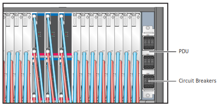

## Power On Compute and IO Cabinets

Power on liquid-cooled and standard rack cabinet PDUs.

**Liquid-cooled Cabinets** - HPE Cray EX liquid-cooled cabinet CDU and PDU circuit breakers are controlled manually.

After the CDU is switched on and healthy, the liquid-cooled PDU circuit breakers can be switched ON. With PDU breakers ON, the Chassis Management Modules \(CMM\) and Cabinet Environmental Controllers \(CEC\) power on and boot. These devices can then communicate with the management cluster and larger system management network. HVDC power remains OFF on liquid-cooled chassis until environmental conditions are normal and the CMMs receive a chassis power-on command from Cray System Management \(CSM\) software.

**Standard Racks** - HPE Cray standard EIA racks include redundant PDUs. Some PDU models may require a flat-blade screw driver to open or close the PDU circuit breakers.

### Prerequisites

* The cabinet PDUs and coolant distribution units are connected to facility power and are healthy.
* An authentication token is required to access the API gateway and to use the `sat` command. See the [System Security and Authentication](../security_and_authentication/System_Security_and_Authentication.md) and "SAT Authentication" in the System Admin Toolkit (SAT) product stream documentation.

### Procedure

1.  Verify with site management that it is safe to power on the system.

2. If the system does not have Cray EX liquid-cooled cabinets, proceed to step 7.


**POWER ON CRAY EX LIQUID-COOLED CABINET CIRCUIT BREAKERS**

3. Power on the CDU for the cabinet cooling group.

   1.  Open the rear door of the CDU.

   2.  Set the control panel circuit breakers to ON.

   

4. Set the PDU circuit breakers to on in each Cray EX cabinet.

   

5. Verify the status LEDs on the PSU are OK.

   

6. Use the System Admin Toolkit \(`sat`\) to power on liquid-cooled cabinets chassis and slots.

   ```bash
   ncn-m001#  sat bootsys boot --stage cabinet-power
   ```

   This command resumes the hms-discovery job which initiates power-on of the liquid-cooled cabinets. The `--stage cabinet-power` option controls power only to liquid-cooled cabinets.

   If `sat bootsys` fails to schedule hms-discovery with the following message, then delete and recreate the cron job.

   ```bash
   ERROR: The cronjob hms-discovery in namespace services was not scheduled within expected window after being resumed.
   ```

   If `sat bootsys` fails to power on the cabinets through hms-discovery, use CAPMC to manually power on the cabinet chassis, compute blade slots, and all populated switch blade slots \(1, 3, 5, and 7\). This example shows cabinets 1000-1003.

   ```bash
   ncn-m001# cray capmc xname_on create --xnames x[1000-1003]c[0-7] --format json
   ncn-m001# cray capmc xname_on create --xnames x[1000-1003]c[0-7]s[0-7] --format json
   ncn-m001# cray capmc xname_on create --xnames x[1000-1003]c[0-7]r[1,3,5,7] --format json
   ```

**POWER ON STANDARD RACK PDU CIRCUIT BREAKERS**

7. Switch the standard rack compute and I/O cabinet PDU circuit breakers to ON.

   This applies power to the server BMCs connects them to the management network. Compute and I/O nodes **do not power on and boot automatically**. The Boot Orchestration Service \(BOS\) brings up compute nodes and User Access Nodes \(UANs\).

   If necessary, use IPMI commands to power on individual servers as needed.

8. Make sure all system management network switches and Slingshot network switches are powered on in each rack and there are no error LEDS or hardware failures.


