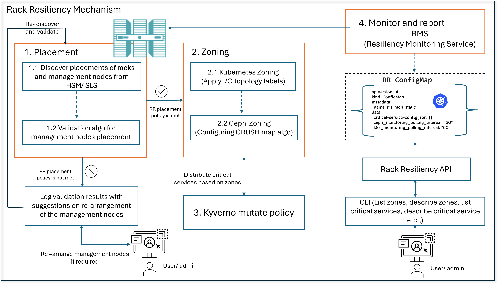

# Rack Resiliency (RR)

- [Introduction](#introduction)
- [Key terminology](#key-terminology)
- [Architecture overview](#architecture-overview)
- [Components of Rack Resiliency](#components-of-rack-resiliency)
    - [Critical Services](README.md#1-critical-services)
    - [ConfigMaps](README.md#2-configmaps)
    - [`Kyverno` Policy](README.md#3-`Kyverno`-policy)
    - [Rack Resiliency Service (RRS)](README.md#4-rack-resiliency-service-rrs)
        - [Resiliency Monitoring Service (RMS)](#resiliency-monitoring-service-rms)
        - [Rack Resiliency API service](#rack-resiliency-api-service)
- [Rack Resiliency management tools](#rack-resiliency-management-tools)
    - [Cray CLI](#cray-cli)
    - [RESTful API](#restful-api)
- [Rack Resiliency management tasks](#rack-resiliency-management-tasks)
    - [Enable and configure Rack Resiliency](README.md#1-enable-and-configure-rack-resiliency)
    - [Managing Critical Services](README.md#2-managing-critical-services)
    - [Managing `Kyverno` policy](README.md#3-managing-`Kyverno`-policy)
- [Troubleshooting](#troubleshooting)

## Introduction

HPE Cray Supercomputing EX systems are designed to maintain high availability (HA) for critical services, even if management nodes fail.
However, rack-level failures can cause service disruptions if management nodes are concentrated within a single rack.
This can result in the loss of HA quorum. Additionally, incorrect physical placement or software configuration of storage nodes
can cause utility storage service disruptions due to rack-level failures.

To address these issues, CSM 1.7.0 introduces the Rack Resiliency feature, which provides management rack level resiliency to maintain HA of critical management services due to a single rack failure.
This feature prevents system-wide outages, allowing for successful execution of user jobs or scheduling new ones.

**NOTE**:

- Rack Resiliency is disabled by default.
- Rack Resiliency can be enabled only during fresh install of CSM 1.7 or an upgrade from CSM 1.6 to CSM 1.7.
- Rack Resiliency cannot be disabled after it has been enabled during the install or upgrade.

## Key terminology

- Rack: A standardized physical structure designed to house and organize computer servers and other hardware like
  network switches. Each HPE Cray Supercomputing EX system rack houses NCNs and non-NCNs, along with
  Slingshot switches. Racks are also referred to as cabinets. 
  
  In Ceph storage, however, a rack represents a logical, hierarchical [bucket](https://docs.ceph.com/en/latest/rados/operations/crush-map/) in the CRUSH map. Ceph racks group together hosts or nodes that are physically located in the same physical rack.
- Placement: Physical arrangement of nodes across racks.
- Failure Domain: Failure domains are minimum infrastructure that provides high availability for CSM services.
- Management Plane Failure Domain(MPFD): This constitutes one or more racks that have management nodes that make up the CSM management plane
  (i.e. failure domain of racks that are running the management plane).
- [Zone](Zones.md): A zone in Rack Resiliency solution is a representation of a logical failure domain.
- Kubernetes zone: A zone in Kubernetes is an isolated failure domain.
- Ceph is the utility storage platform that is used to enable pods to store persistent data. It is deployed to provide block, object, and file storage to the
  management services running on Kubernetes, as well as for telemetry data coming from the compute nodes.
- [Critical Services](Critical_Services.md): In the context of Rack Resiliency, critical services are those services that are critical to execution of user jobs.
  These services are monitored by the [Resiliency Monitoring Service](Resiliency_Monitoring_Service.md).

## Architecture overview

The Rack Resiliency solution is implemented in multiple stages. These stages are:

- [Stage 1 - Feature Enablement](Enabling_Rack_Resiliency.md)
- [Stage 2 - Placement Discovery](Setup.md#stage-2---placement-discovery)
- [Stage 3 - Placement Validation](Setup.md#stage-3---placement-validation)
- [Stage 4 - Kubernetes Zoning](Setup.md#stage-4---kubernetes-zoning)
- [Stage 5 - Ceph Zoning](Setup.md#stage-4---ceph-zoning)
- [Stage 6 - Apply `Kyverno` policy](Setup.md#stage-5---apply-kyverno-policy)
- [Stage 7 - Continuous Monitoring](Resiliency_Monitoring_Service.md)

## Components of Rack Resiliency

### 1. Critical Services

Rack Resiliency monitors specific CSM Services for continuous availability. These services are called critical services. For further details refer to [Critical Services](Critical_Services.md)

### 2. ConfigMaps

Rack Resiliency(RR) uses ConfigMaps to store details about the critical services. They are also used to provide the configuration parameters for the
[Resiliency Monitoring Service](Resiliency_Monitoring_Service.md).

Refer for more information on [ConfigMaps](ConfigMaps.md)

### 3. `Kyverno` policy

One of the ways that Rack Resiliency ensures that CSM critical services survive the failure of nodes or a single rack is to
spread the replicas of these services across multiple zones and racks.

See [`Kyverno` cluster policy](Kyverno.md#Kyverno-cluster-policy) for more information.

### 4. [Rack Resiliency Service](Rack_Resiliency_Service.md) (RRS)

RRS is a new service introduced as part of CSM 1.7.0 to monitor critical services and provide alerts during node or rack
failures. This is designed as a singleton pod (`cray-rrs`). See [`cray-rrs` Deployment](cray-rrs_Deployment.md) for more details.

#### [Resiliency Monitoring Service (RMS)](Resiliency_Monitoring_Service.md)

The Resiliency Monitoring Service (RMS) provides the functionality to detect rack or node failures and monitor critical services post the failure.

Refer for more info on [RMS](Resiliency_Monitoring_Service.md)

#### [Rack Resiliency API service](../../api/rrs.md)

The Rack Resiliency Service (RRS) provides APIs to manage zones and critical services. The API service is a separate container in `cray-rrs` pod and serves as the backend for `rrs` module of Cray CLI. Refer [API](../../api/rrs.md) for more information.

To get complete information on the components and functionalities of RRS [refer here](Rack_Resiliency_Service.md).

## Rack Resiliency management tools

### Cray CLI

- The CLI for interfacing with rack resiliency service is part of Cray CLI. A new module (RRS) is added to Cray CLI to support rack resiliency specific commands.
- Refer [Cray CLI commands for zones](Zones.md#managing-zones) for more information on the commands related to zones.
- Refer [Cray CLI commands for critical services](Manage_Critical_Services.md#critical-services-operations) for more information on the commands related to critical services.
- Refer [Cray CLI commands for critical services healthchecks](Troubleshooting.md#critical-services-healthcheck).

### RESTful API

The RRS RESTful API is used by the Cray CLI and also can be accessed using tools like `curl`.
See [Rack Resiliency Service v1](../../api/rrs.md) for more information.

## Rack Resiliency management tasks

### 1. Getting started with Rack Resiliency

Rack Resiliency uses a 3 step procedure to be set up for monitoring critical services:

1. [Enabling Rack Resiliency and add zone prefixes](../../operations/rack_resiliency/Enabling_Rack_Resiliency.md#enabling-rack-resiliency)
2. [Setup Rack Resiliency](../../operations/rack_resiliency/Setup.md#running-ansible-playbooks)
3. [`cray-rrs` Deployment](cray-rrs_Deployment.md)

### 2. Managing critical services

During the execution of RRS there maybe a need to manage critical services, which may need administrator intervention. This can be done using the Cray CLI or the API.
Refer [Manage Critical Services](Manage_Critical_Services.md) for complete list of supported operations.

### 3. Managing `Kyverno` policy

While managing critical services the `Kyverno` policy also needs to be managed. Refer [Manage `Kyverno` policy](Manage_Critical_Services.md#add-critical-services-to-`Kyverno`-clusterpolicy) for complete list of supported operations.

## Troubleshooting

There are scenarios which need administrator interference. For complete list of scenarios related to different components of Rack Resiliency refer to [Troubleshooting](Troubleshooting.md).
