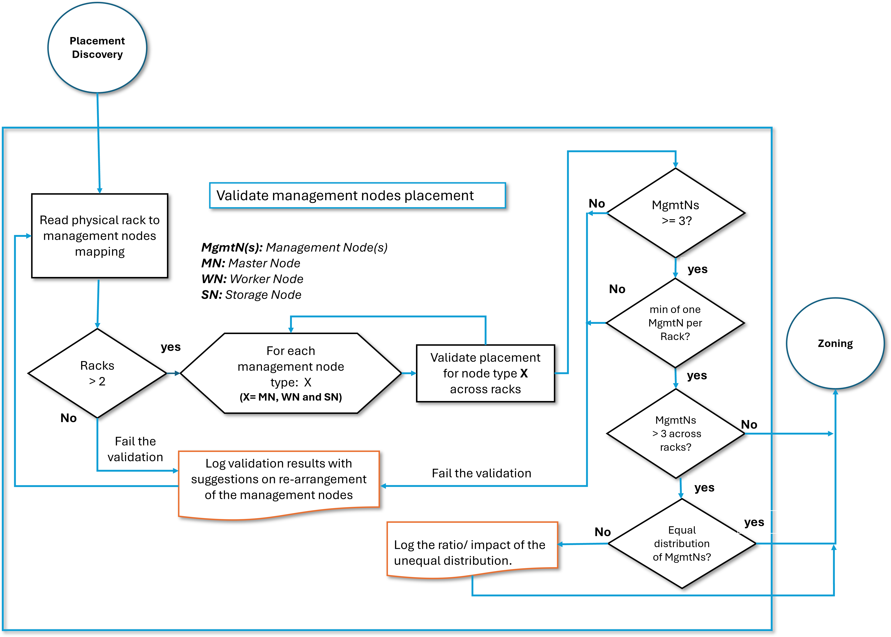

# Setup of Rack Resiliency

The configuration of Rack Resiliency happens as part of
[Management Node Personalization](../configuration_management/Management_Node_Personalization.md).
Specifically, the setup is done by the `rack_resiliency_for_mgmt_nodes.yml` Ansible playbook in the
`csm-config-management` [Version Control Service (VCS)](../../glossary.md#version-control-service-vcs)
repository.

If Rack Resiliency is not enabled, then this playbook will do nothing.
See [Enabling Rack Resiliency](Enabling_Rack_Resiliency.md) for details on
how it is enabled.

## Setup flows

There are two setup flows -- one for setting up Kubernetes, and one for setting up Ceph.
There are some shared preparation steps, but the actual configuration steps differ.

### Common preparation flow

| *Stage*                                       | *Ansible role*                           |
| --------------------------------------------- | ---------------------------------------- |
| [Verify enablement](#verify-enablement)       | `csm.rr.check_enablement`                |
| [Placement discovery](#placement-discovery)   | `csm.rr.mgmt_nodes_placement_discovery`  |
| [Placement validation](#placement-validation) | `csm.rr.mgmt_nodes_placement_validation` |

### Kubernetes setup flow

| *Stage*                                       | *Ansible role*               |
| --------------------------------------------- | ---------------------------- |
| [Kubernetes zoning](#kubernetes-zoning)       | `csm.rr.k8s_topology_zoning` |

### Ceph setup flow

| *Stage*                                                   | *Ansible role*        |
| --------------------------------------------------------- | --------------------- |
| [Ceph zoning](#ceph-zoning)                               | `csm.rr.ceph_zoning`  |
| [Ceph HAproxy configuration](#ceph-haproxy-configuration) | `csm.rr.ceph_haproxy` |

## Preparation

The below stages are preparatory steps to setup Kubernetes and Ceph for Rack Resiliency.

### Verify enablement

This Ansible role verifies that Rack Resiliency is enabled in `customizations.yaml`.
If it is not enabled, then the RR setup is skipped.

### Placement discovery

This Ansible role identifies the physical racks and locates the management nodes in it.
The [Hardware State Manager (HSM)](../../glossary.md#hardware-state-manager-hsm) is queried
for information on all of the management NCNs. This information is used to create a mapping
between the [xnames](../../glossary.md#xname) of the management NCNs and the xnames of the
physical racks that contain them.

The [System Layout Service (SLS)](../../glossary.md#system-layout-service-sls) is used to map
these management node xnames to the corresponding Kubernetes and storage node names.
This mapping of rack xnames to Kubernetes and storage node hostnames is stored in the below format
as a JSON file to be consumed by the Kubernetes and Ceph zoning modules later.

Example of JSON file containing rack to management NCN hostname mapping:

```json
{
    "x3000": [
        "ncn-m001",
        "ncn-w001",
        "ncn-w004",
        "ncn-w007",
        "ncn-s001"
    ],
    "x3001": [
        "ncn-m002",
        "ncn-w002",
        "ncn-w006",
        "ncn-w005",
        "ncn-w008",
        "ncn-s003"
    ],
    "x3002": [
        "ncn-m003",
        "ncn-w003",
        "ncn-w009",
        "ncn-s002",
        "ncn-s004"
    ]
}
```

### Placement validation

This Ansible role uses the discovery results from
[Placement discovery](#placement-discovery) and validates whether the current
placement meets the required criteria for enabling rack resiliency.



The placement validation algorithm, as shown in the flow chart above, decides whether the current
placement of management nodes is suitable for enabling rack resiliency. If it is found that the
current placement is not suitable for rack resiliency, the validation fails.

This module also evaluates if managed nodes are present in the management rack and informational
messages are generated for the same.

**Note**: [Slingshot](../../glossary.md#slingshot) switch placement discovery and validation is
not included in this process.

## Kubernetes setup

The below stage is used to setup Kubernetes zones.

### Kubernetes zoning

This Ansible role uses the discovery results from
[Placement discovery](#placement-discovery) and applies Kubernetes zoning for
master and worker nodes. For more information, see [Kubernetes zones](Zones.md#kubernetes-zones).

## Ceph setup

The below stages are used to setup the Ceph zones and update Ceph HAproxy configuration.

### Ceph zoning

This Ansible role uses the discovery results from
[Placement discovery](#placement-discovery) and applies Ceph zoning for
storage nodes. Along with creating zones for Ceph storage nodes, zones for the Ceph services are
also created. For more information, see [Ceph zones](Zones.md#ceph-zones).

### Ceph HAproxy configuration

This Ansible role updates Ceph HAproxy configuration with latest information after performing
Ceph zoning. It also updates `ceph.conf` with latest configuration, on all storage nodes.

[operations/rack_resiliency/Setup_of_Rack_Resiliency.md](#ceph-zoning)

[operations/rack_resiliency/Setup_of_Rack_Resiliency.md](#placement-discovery)
