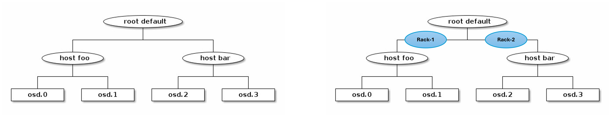

# Zones

Rack Resiliency defines a logical grouping of Kubernetes master, Kubernetes worker and Ceph storage nodes(NCNs) in a **single rack** as a management plane failure domain(MPFD).
The racks which supports only non-NCNs, do not fall in the category of Rack Resiliency MPFD. During the setup of Rack Resiliency, it is validated that any MPFD should include the following minimal hardware:

- 1 Kubernetes Master node
- 1 Kubernetes Worker node
- 1 Ceph Storage node

To map MPFD to Kubernetes and Ceph, Rack Resiliency uses the following methodologies:

- For Kubernetes, Rack Resiliency uses the concept of [topology spread constraint](https://kubernetes.io/docs/concepts/scheduling-eviction/topology-spread-constraints/) to implement zoning for Master and Worker nodes.
- For Ceph, Rack Resiliency uses the [concepts of buckets](https://docs.ceph.com/en/reef/architecture/) built with CRUSH algorithm to implement zoning for storage nodes.

**Note:**

- Ceph is hierarchical storage based on hierarchy of “buckets”. Rack Resiliency uses the bucket called **rack** on top of the **host** bucket to
  create the MPFD for storage nodes.

## Setting up MPFD for Kubernetes nodes

The Kubernetes [topology spread constraints](https://kubernetes.io/docs/concepts/scheduling-eviction/topology-spread-constraints/) can be used to apply labels to nodes in order to create management plane failure domains (`MPFDs`).

Each node in every MPFD is labeled with the key `topology.kubernetes.io/zone` and value `<zone-id>`, where `<zone-id>` is of the form `x3000`, `x3001`, and so on.
These labels can be used to identify all the management nodes which belong to the same MPFD (Kubernetes zone) and is used to schedule the critical services across the zones.

### Command to view Kubernetes zones

To view Kubernetes zones use the below command:

```bash
(ncn-mw#) kubectl get nodes -L topology.kubernetes.io/zone
```

Example Output:

```text
NAME       STATUS   ROLES           AGE   VERSION   ZONE
ncn-m001   Ready    control-plane   21d   v1.32.5   x3000
ncn-m002   Ready    control-plane   20d   v1.32.5   x3001
ncn-m003   Ready    control-plane   20d   v1.32.5   x3002
ncn-w001   Ready    <none>          20d   v1.32.5   x3000
ncn-w002   Ready    <none>          20d   v1.32.5   x3001
ncn-w003   Ready    <none>          20d   v1.32.5   x3002
ncn-w004   Ready    <none>          20d   v1.32.5   x3000
```

**Note:**

- zone-id for each Kubernetes zone can be optionally prefixed with a site-init specific string.
- For more information on adding prefix refer to [Enabling Rack Resiliency](Enabling_Rack_Resiliency.md#enabling-rack-resiliency).
- By default, zone-id is decided based on the xname (1-5 chars) of the Kubernetes node.

## Setting up MPFD for Ceph nodes

Similar to Kubernetes topology spread constraints (for Master and Worker), Ceph zoning is required on Storage nodes (Utility storage nodes) for creating management plane failure domains (`MPFD`).
The objective of Ceph zoning is to make sure Ceph data gets replicated at rack level across Storage nodes, so that there is no data loss occurs in case of a rack failure.
Ceph provides the CRUSH map algorithm which helps to segregate the storage nodes across zones. Using a combination of CRUSH rules and bucket types (hosts, racks, rows, etc.), the data can be replicated across zones.

## 1 Creating Ceph zones with CRUSH



Currently CSM has **host** as the top of [hierarchy of bucket](https://docs.ceph.com/en/latest/rados/operations/crush-map/) of Ceph.
To implement MPFD domains for storage nodes, the new bucket **rack** is introduced on top of the hierarchy. As shown in the above diagram, storage nodes get added to a **rack** bucket based on their physical location in the rack.
Refer to [placement discovery](Setup.md#stage-2---placement-discovery) for details on how physical placement of storage nodes is discovered.
More than one storage node can be added to the same bucket.

Rack Resiliency preconfigures rack buckets as well as adds the storage nodes to them. Refer to [Ceph zoning](Setup.md#stage-4---ceph-zoning) for details on how the nodes discovered during placement discovery are grouped in rack buckets.

## 2 Ceph service zoning

The current Ceph setup on CSM deploys three sets of Ceph services (Monitors, Managers, and MDS) on the nodes `ncn-s001`, `ncn-s002`, and `ncn-s003` in a hard-coded configuration.
This approach, however, does not support Rack Resiliency, as the services are statically assigned to specific nodes.

To enhance Rack Resiliency, this solution distributes the Ceph services across multiple racks.
The storage nodes assigned to each service is selected using a round-robin distribution strategy across the rack buckets, ensuring a balanced and fault-tolerant configuration.
Also, the number of Ceph Monitor services deployed will be either 3 or 5, depending on the total number of storage nodes and their distribution across rack buckets. 
The above process ensures that the Ceph cluster remains operational in the event of a rack failure.

For details on how Ceph services are zoned refer to [Ceph service zoning](Setup.md#stage-4---ceph-zoning).

### Command to view ceph zones

To view ceph zones use the below command:

```bash
(ncn-mw#) ceph osd tree | grep rack
```

Example Output:

```text
 -9         13.97278      rack x3000
-11         13.97278      rack x3001
-13         13.97278      rack x3002
```

**Note:**

- zone-id for each Ceph zone can be optionally prefixed with a site-init specific string.
- For more information on adding prefix refer to [Enabling Rack Resiliency](Enabling_Rack_Resiliency.md#enabling-rack-resiliency).
- By default, zone-id is decided based on the xname (1-5 chars) of the Ceph node.
  
## Managing Zones

To view and get details about the Rack Resiliency zones use the below Cray CLI commands:

- List all configured zones:

    ```bash
    (`ncn-mw#`) cray rrs zones list
    ```

    Example Output:

    ```text
    [[Zones]]
    Zone_Name = "x3000"

    [Zones.Kubernetes_Topology_Zone]
    Management_Master_Nodes = [ "ncn-m001",]
    Management_Worker_Nodes = [ "ncn-w001", "ncn-w004",]
    [Zones.CEPH_Zone]
    Management_Storage_Nodes = [ "ncn-s001",]
    [[Zones]]
    Zone_Name = "x3001"

    [Zones.Kubernetes_Topology_Zone]
    Management_Master_Nodes = [ "ncn-m002",]
    Management_Worker_Nodes = [ "ncn-w002",]
    [Zones.CEPH_Zone]
    Management_Storage_Nodes = [ "ncn-s003",]
    [[Zones]]
    Zone_Name = "x3002"

    [Zones.Kubernetes_Topology_Zone]
    Management_Master_Nodes = [ "ncn-m003",]
    Management_Worker_Nodes = [ "ncn-w003",]
    [Zones.CEPH_Zone]
    Management_Storage_Nodes = [ "ncn-s002",]
    ```

- Get detailed information about a specific zone:

    ```bash
    (`ncn-mw#`) cray rrs zones describe <zone-id>
    ```

    Example Output:

    ```text
    Zone_Name = "x3000"

    [Management_Master]
    Count = 1
    Type = "Kubernetes_Topology_Zone"
    [[Management_Master.Nodes]]
    name = "ncn-m001"
    status = "Ready"

    [Management_Worker]
    Count = 2
    Type = "Kubernetes_Topology_Zone"
    [[Management_Worker.Nodes]]
    name = "ncn-w001"
    status = "Ready"

    [[Management_Worker.Nodes]]
    name = "ncn-w004"
    status = "Ready"

    [Management_Storage]
    Count = 1
    Type = "CEPH_Zone"
    [[Management_Storage.Nodes]]
    name = "ncn-s001"
    status = "Ready"

    [Management_Storage.Nodes.osds]
    up = [ "osd.1", "osd.4", "osd.7", "osd.10", "osd.13", "osd.16", "osd.20", "osd.23",]
    ```

    This command returns detailed information about the zone, including the Kubernetes and storage NCNs that
    belong to it, along with their statuses.
