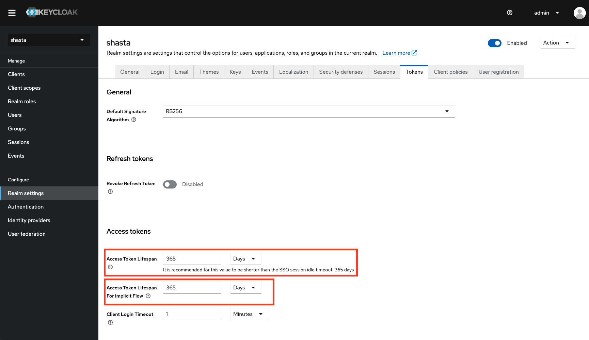
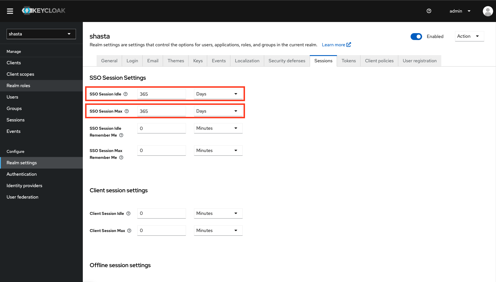
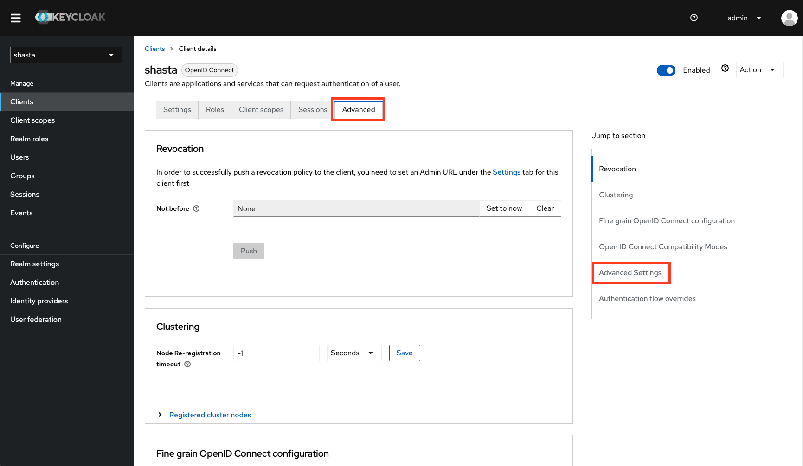
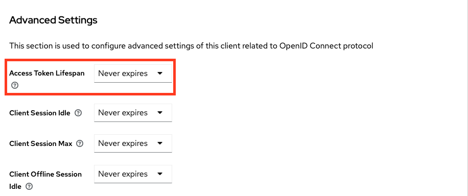

# Change the Keycloak Token Lifetime

This document outlines how to change the Keycloak default token lifetime or the token
lifetime for a specific client.

Note: The default value for these settings is 365 days.

## Procedure

1. Log in to Keycloak with the default admin credentials.

    1. Retrieve the `admin` user's password for Keycloak.

       ```bash
       kubectl get secrets -n services keycloak-master-admin-auth -ojsonpath='{.data.password}' | base64 -d
       ```

    1. Log in to the Keycloak UI using the `admin` user and the password obtained in the previous step.

       The Keycloak UI URL is typically similar to the following: `https://auth.cmn.<system_name>/keycloak`

1. Change Global Token Lifetime Values

    1. Select `Realm Settings` under `Configure` on the left of the `admin` page.
    1. Select the `Tokens` tab.
    1. Change the following options to the appropriate lifetime values:
       - `Access Token Lifespan`
       - `Access Token Lifespan for Implicit Flow`
    1. Click `Save` at the bottom of the page.
    1. Select the `Sessions` tab.
    1. Change the following options to the appropriate lifetime values:
       - `SSO Session Idle`
       - `SSO Session Max`
    1. Click `Save` at the bottom of the page.

    
    

1. Change A Specific Client's Token Lifetime

    1. Select `Clients` under `Manage` on the left of the `admin` page.
    1. Select the client that you wish to change the token lifetime for.
    1. Select the `Advanced` tab.
    1. Go to the `Advanced Settings` section.
    1. Change the `Access Token Lifespan` to the appropriate lifetime value.
    1. Click `Save` at the bottom of the page.

    

    
