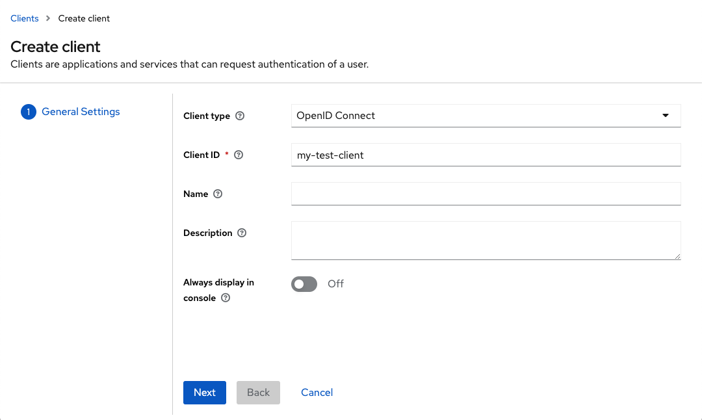
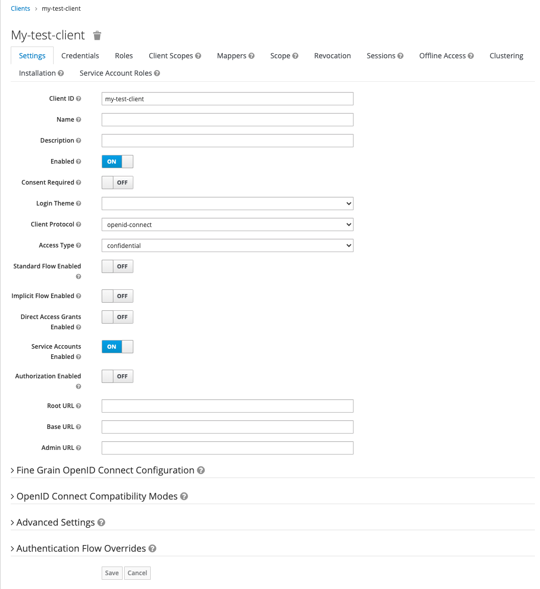
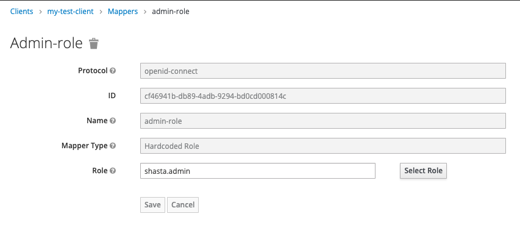

## Create a Service Account in Keycloak

Set up a Keycloak service account using the Keycloak administration console or the Keycloak REST API. A service account can be used to get a long-lived token that is used by automation tools.

In Keycloak, service accounts are associated with a client. See [https://www.keycloak.org/docs/latest/server\_admin/\#\_service\_accounts](https://www.keycloak.org/docs/latest/server_admin/#_service_accounts) for more information from the Keycloak documentation.

### Procedure

Follow the steps in only one of the following sections depending on if it is preferred to use the Keycloak REST API or Keycloak administration console UI.

#### Use the Keycloak Administration Console UI

1. Log in to the administration console.

   See [Access the Keycloak User Management UI](Access_the_Keycloak_User_Management_UI.md) for more information.

2. Click **Clients** under the Configure header of the navigation panel on the left side of the page.

3. Click the **Create** button at the top-right of the Clients table.

   

   1.  Enter a Client ID for the new client.

       The Client Protocol must be openid-connect and the Root URL can be left blank.

   2.  Click the **Save** button.

4. Customize the new client.

   Once the client is created, a new screen is displayed with more details for the client.

   

   1.  Change the Access type to confidential.

   2.  Change Stand Flow Enabled to **OFF**.

   3.  Change Direct Access Grants Enabled to **OFF**.

   4.  Change Service Accounts Enabled to **ON**.

   5.  Click the **Save** button.

5. Assign a role to the client for authorization.

   

   1.  Switch to the **Mappers** tab for the new client.

   2.  Click the **Create** button at the top-right of the Mappers table.

       A new form is displayed that asks for details for the mapper.

   3.  Enter a name.

       In the image above, the example name is "admin-role."

   4.  Change the Mapper Type to Hardcoded Role.

   5.  Set the Role to shasta.admin.

   6.  Click the **Save** button.


#### Use the Keycloak REST API

1.  Create the get\_master\_token function to get a token as a Keycloak master administrator.

  ```screen
  MASTER_USERNAME=$(kubectl get secret -n services keycloak-master-admin-auth -ojsonpath='{.data.user}' | base64 -d)
  MASTER_PASSWORD=$(kubectl get secret -n services keycloak-master-admin-auth -ojsonpath='{.data.password}' | base64 -d)

  function get_master_token {
    curl -ks -d client_id=admin-cli -d username=$MASTER_USERNAME -d password=$MASTER_PASSWORD -d grant_type=password https://api-gw-service-nmn.local/keycloak/realms/master/protocol/openid-connect/token | python -c "import sys,json; print json.load(sys.stdin)['access_token']"
  }
  ```

2. Create the client doing a POST call for a JSON object.

   The `clientId` should be changed to the name for the new service account.

  ```screen
  ncn-w001# curl -is -H "Authorization: Bearer $(get_master_token)" -H "Content-Type: application/json" -d '
  {
    "clientId": "my-test-client",
    "standardFlowEnabled": false,
    "implicitFlowEnabled": false,
    "directAccessGrantsEnabled": false,
    "serviceAccountsEnabled": true,
    "publicClient": false,
    "protocolMappers": [
      {
        "name": "admin-role",
        "protocol": "openid-connect",
        "protocolMapper": "oidc-hardcoded-role-mapper",
        "consentRequired": false,
        "config": {
          "role": "shasta.admin"
        }
      }
    ]
  }
  ' \
  https://api-gw-service-nmn.local/keycloak/admin/realms/shasta/clients

  ```

  Output similar to the following will be returned:

  ```screen
  HTTP/2 201
  location: https://api-gw-service-nmn.local/keycloak/admin/realms/shasta/clients/bd8084d2-08bf-45cb-ab94-ee81e39921be
  content-length: 0
  ```


