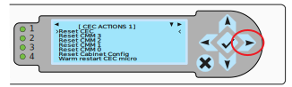

## Provisioning a Liquid-Cooled EX Cabinet CEC with Default Credentials

This procedure provisions a Glibc compatible SHA-512 administrative password hash to a cabinet environmental controller (CEC). This password becomes the Redfish default global credential to access the CMM controllers and node controllers (BMCs). 

This procedure does not provision Slingshot switch BMCs. Slingshot switch BMC default credentials must be changed using the procedures in the Slingshot product documentation. Refer to "Change Switch BMC Passwords" in the Slingshot product documentation for more information. 

### Prerequisites

- The administrator must have physical access to the CEC LCD panel to enable privileged command mode. The CEC does not enable users to set, display, or clear the password hash in restricted command mode. 

- An Apple Mac or Linux laptop that supports 10/100 IPv6 Ethernet connectivity to the CEC Ethernet port is recommended. A Windows system running a Linux emulation package may have difficulties establishing a stable network connection to the CEC.

- A customer-generated hash for the CEC credentials:

   - The `passhash` tool that is installed on the CMMs can be used to generate a SHA-512 password hash. This HPE tool is provided for convenience, but any tool that generates an SHA-512 hash that is compatible with glibc can be used. The salt portion must be between 8 and 16 chars inclusive. The CEC does not support the optional "rounds=" parameter in the hash.
   - See the `man 3 crypt` page for a description: https://man7.org/linux/man-pages/man3/crypt.3.html

  ```screen
  remote# passhash PASSWORD $6$v5YlqxKB$scBci.GbT8Uf3ZPcGwrW07zEjGdq6q7/FdQGCclxh05IPCINm9SOt2RLHfdPE9UE/Ng5dtc5qCBCoSLHSW84L1
  ```

### Procedure

1. Disconnect the CEC Ethernet cable from the Ethernet port.
   
2. Connect an Ethernet cable from an Apple Mac or Linux laptop to the CEC Ethernet port.
   The CEC Ethernet PHY will auto negotiate to either 10/100Mb speed and it supports auto crossover functionality. Any standard Ethernet patch cord should work for this.

   

3. Use the Right Arrow on the display controls to select the CEC Network Settings Menu. The IPv6 link local address is displayed on this menu.

4. Start the terminal program and use Netcat (`nc`) or `telnet` to connect to CEC command shell and provide the CEC IPv6 link local address

   ```screen
   # nc -t -6 'fe80::a1:3e8:0%en14' 23
   ```

   ```
   # telnet fe80::a1:3e8:0%eth0
   ```

   - `en14` and `eth0` in these examples are the Ethernet interfaces for the laptop.

   - Enter return a few times to start the connection.

   - **NOTE**: If the network connection to the CEC is lost, or if a CEC command does not return to the prompt, it may be necessary to reboot the CEC.  Use the Right Arrow on the CEC control panel to display the Action menu, select Reset CEC, and press the green checkmark button to reboot the CEC. Then re-establish the `nc` or `telnet` connection. 

     

5. From the CEC> prompt, enter help to view the list of commands.

   ```screen
   CEC> help
   ```

   **CAUTION**: Run only the CEC commands in this procedure. Do not change other CEC settings.

6. From the `CEC>` prompt, generate an unlock token for the CEC. Use the `enable` command (alias for `unlock` command) without arguments to display a random unlock token on the CEC front panel.

   ```screen
   CEC> enable
   ab12903c
   ```

7. Record the unlock token displayed on the CEC front panel.

   The unlock code is valid as long as the remote shell connection is open to the CEC. If you enter the unlock token incorrectly, a new unlock token is displayed on the front panel.

8. Enter the enable command again but supply the token as an argument to unlock the CEC and enter privileged command mode.

   ```screen
   CEC> enable AB12903C
   EXE>
   ```

   If the token code is typed in incorrectly a new one is generated on screen. When unlocked, the LCD screen displays `UNLOCKED` and the shell prompt changes to `EXE>`.

   Do not use the `get_hash` command to display the password hash. If there is no password hash set, this command will not return to the prompt and the connection will be lost.

9. Enter `set_hash` and provide the password hash value as the argument.

   The CEC validates the input syntax of the hash. Adding an extra char or omitting a character is flagged as an error. I a character is changed, the password entered in the serial console login shell or the Redfish `root` account will not work. If that happens, rerun the `set_hash` command on the CEC and reboot the CMMs.

      ```screen
      EXE> set_hash $6$v5YlqxKB$scBci.GbT8Uf3ZPcGwrW07zEjGdq6q7/FdQGCclxh05IPCINm9SOt2RLHfdPE9UE/Ng5dtc5qCBCoSLHSW84L1
      ```

10. Exit privileged command mode.

   ```screen
   EXE> lock
   CEC>
   ```

   The CEC remains in privileged mode until it is reset with the `lock` command or if the **X** button on the CEC front panel is pressed. Typing `exit` or terminating the connection exits privileged mode. There is no connection timeout.

11. Use the front panel Right Arrow to select the CEC Action menu.

12. Reset the CMMs 3, 2, 1, and 0. 

    The Reset CMM commands reboot either the even numbered, or odd numbered CMMs in the cabinet, depending on which CEC is issuing the commands.

    

13. To test the password, connect to the CMM serial console though the CEC. The IPv6 address is the same, but the port numbers are different as described below. 

      ```screen
      #!/bin/bash
      trap "stty sane && echo ''" EXIT
      stty -icanon -echo
      nc -6 'fe80::a1:2328:0%en14' 50000
      ```

      - The even numbered CEC manages the CMM serial console for chassis 0, 2, 4, 6 on TCP port numbers 50000-50003 respectively. 
      - The odd numbered CEC manages the CMM serial console for chassis 1, 3, 5, 7 on TCP port numbers 50000-50003 respectively. 
      - If using the script shown in the example to connect to the CMM console, type `exit` to return to the CMM login prompt and enter ctrl-c to close the console connection.

14. Perform this procedure for each CEC in all system cabinets.

      HPE Cray EX2000 cabinets (Hill) have a single CEC per cabinet.
