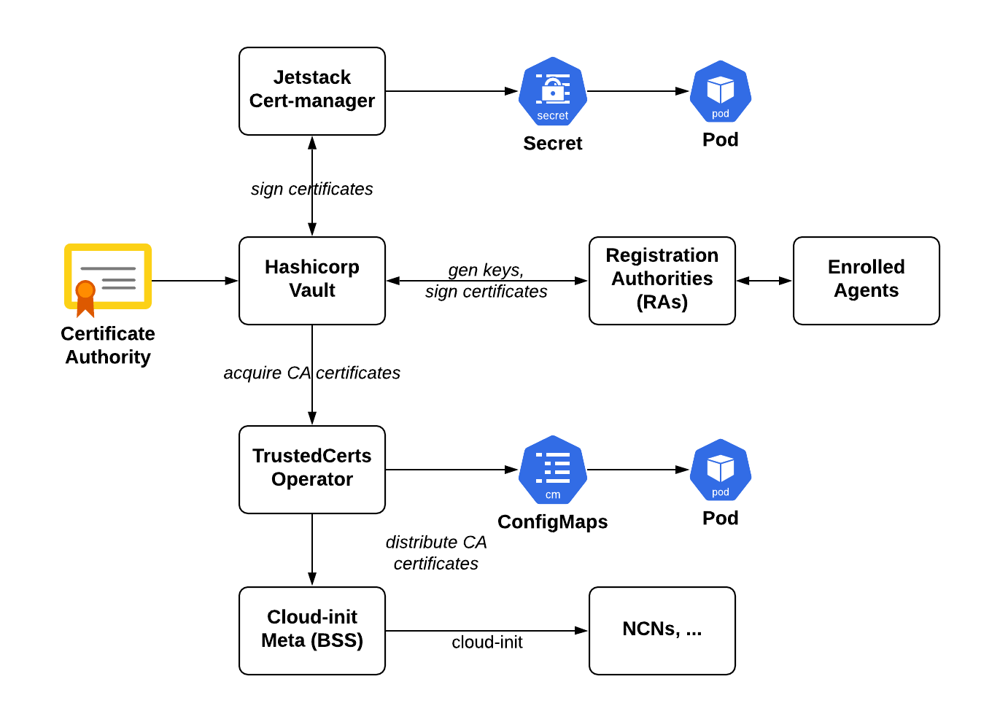

# Public Key Infrastructure \(PKI\)

Public Key Infrastructure \(PKI\) represents the algorithms, infrastructure, policies, and processes required to leverage applied public key cryptography methods for operational security use cases. The Rivest-Shamir-Adleman \(RSA\) and Elliptic-curve \(ECC\) are some example algorithm systems.

The use of PKI for the system is in the Transport Layer Security \(TLS\) protocol, which is the successor of the now deprecated Secure Sockets Layer \(SSL\). This is where trusted chains of Certificate Authorities \(CAs\) are used to authenticate the identity of servers, and sometimes clients \(for example, mutual TLS\) for relying parties. This chain of trust is anchored by a root CA and is used to make assertions that a particular public and private key pair belong to a given party by assigning a certificate for the party. This party is still required to prove they actually own the key material through enciphering, deciphering, and digital signature operations that require private keys that are not shared amongst parties. However, public keys are shared through certificates and are policy bound in that respect.

The PKI implementation for the system, post-installation, is made up of Kubernetes services \(illustrated in the "Public Key Infrastructure" figure\). During installation, the platform can be directed to either generate certificate authorities \(CAs\), or a customer-supplied intermediate CA can be supplied. After installation, the CA material resides in a Kubernetes Secret, and ultimately in the HashiCorp Vault.

Refer to [PKI Services](PKI_Services.md) for more information on the services in the figure above.

### Limitations

The following limitations exist within the PKI implementation:

-   An outstanding bug in the Keycloak Gatekeeper service prevents it from updating its TLS certificate and key material upon Cert-manager renewal
    -   It may be necessary to monitor the situation and proactively renew/force reload Keycloak Gatekeeper.

-   Supported Cryptography Suite\(s\)
    -   RSA-based CAs and certificates are currently supported. CAs must have either a 3072- or 4096-bit modulus and use SHA256 as the signature algorithm. Installation paths are designed to force convention.

        Password encrypted private keys are also not currently supported.

-   CA "Rotation"
    -   Changing the platform CA post-installation is not currently supported. Changing it requires a re-install.

-   Implications of Transitive Trust
    -   If the platform is configured to generate a dynamic CA, then customer services or users that interact with the platform must trust the platform CA to validate TLS sessions. Thus, provided the platform has a disjoint DNS domain name \(for example, shasta.acme.org\), and the PKI trust realm is established at or 'below' \(subdomains\) this FQDN, a compromise of platform CA material should be limited to the platform itself \(subject to many nuances\).

        If a customer supplies a CA to the platform, and the CA is part of an expanded PKI trust realm, a compromise of platform CA material could be leveraged to compromise the broader environment through PKI APIs available on the system. Customers should consider this risk, and, if providing a CA is desired, maybe strictly limit the PKI trust realm established by the provided CA.

-   Abuse of PKI APIs to Sign Malicious Products
    -   Compromise of a platform could lead to the generation of certificates for potentially malicious workloads.

        Current HashiCorp Vault policies that control legitimate signing activities are fairly broad in allowed certificate CSR properties. This is due largely to common name and SAN requirements for certificate workloads across the platform.

-   Security of CA Material
    -   During installation, CA material is exposed:

        -   When they are staged by the installer
        -   By installation processes \(e.g., shasta-cfg\)
        After installation, CA material is exposed:

        -   In a SealedSecret
        -   In a Kubernetes Secret
        -   In Kubernetes etcd backups and backups taken of the platform otherwise
        -   To Vault
        -   Through the creation of additional subordinate CAs for Spire
-   Revocation Lists and OSCP
    -   The platform does not provide revocation lists or access to a revocation service \(OSCP\).

-   Key Escrow
    -   The platform does not provide any key escrow services.

