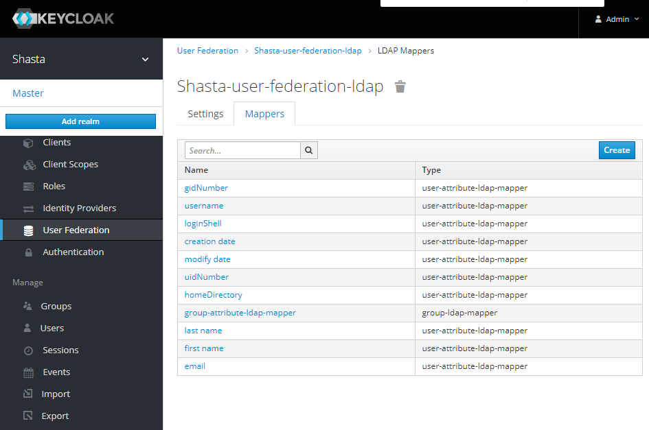

# Remove the Email Mapper from the LDAP User Federation

The email mapper is automatically added to the LDAP user federation in Keycloak, but it can be removed. The system does not use the user's email for anything, so this function can be removed.

If there are duplicate email addresses for LDAP users, it can cause Keycloak to have issues syncing with LDAP. Removing the email mapper will fix this problem.

### Procedure

1.  Create a function to get a token as a Keycloak master administrator.

    ```bash
    MASTER_USERNAME=$(kubectl get secret -n services keycloak-master-admin-auth -ojsonpath='{.data.user}' | base64 -d)
    MASTER_PASSWORD=$(kubectl get secret -n services keycloak-master-admin-auth -ojsonpath='{.data.password}' | base64 -d)

    function get_master_token {
      curl -ks -d client_id=admin-cli -d username=$MASTER_USERNAME -d password=$MASTER_PASSWORD -d grant_type=password https://api-gw-service-nmn.local/keycloak/realms/master/protocol/openid-connect/token | python -c "import sys.json; print json.load(sys.stdin)['access_token']"
    }
    ```

2.  Verify that the new get\_master\_token function is working.

    If the function is working, it will return a long string that is base64-encoded.

    ```bash
    ncn-w001# get_master_token
    eyJhbGciO...YceX4Ig
    ```

3.  Get the ID of the LDAP user federation.

    Replace SHASTA-USER-FEDERATION-LDAP in the command below with the name of the user federation being used.

    ```bash
    ncn-w001# FEDERATION_ID=$(curl -s -H "Authorization: Bearer $(get_master_token)" \
    https://api-gw-service-nmn.local/keycloak/admin/realms/shasta/components?name=SHASTA-USER-FEDERATION-LDAP \
    | jq .[0].id -r)

    ncn-w001# echo $FEDERATION_ID
    e080d20a-51b0-40ad-8f21-98f7b752e39c
    ```

4.  Get the ID of the email mapper.

    ```bash
    ncn-w001# EMAIL_COMPONENT_ID=$(curl -s -H "Authorization: Bearer $(get_master_token)" \
    "https://api-gw-service-nmn.local/keycloak/admin/realms/shasta/components?name=email&parent=$FEDERATION_ID" \
    | jq .[0].id -r)

    ncn-w001# echo $EMAIL_COMPONENT_ID
    ba3cfe20-c2ed-4c92-aac0-3b6fc865989c
    ```

5.  Delete the email mapper.

    ```bash
    ncn-w001# curl -i -s -XDELETE -H "Authorization: Bearer $(get_master_token)" \
    https://api-gw-service-nmn.local/keycloak/admin/realms/shasta/components/$EMAIL_COMPONENT_ID
    ```

6.  Verify in the Keycloak UI that there is no longer an email mapper for the LDAP user federation.

    For more information on accessing the Keycloak UI, see [Access the Keycloak User Management UI](Access_the_Keycloak_User_Management_UI.md).

    The email row shown in the image below should no longer be present.

    

7.  Click the **Synchronize all users** button in the **Settings** tab for the LDAP user federation.

    The **Synchronize all users** button will be at the bottom of the page.

