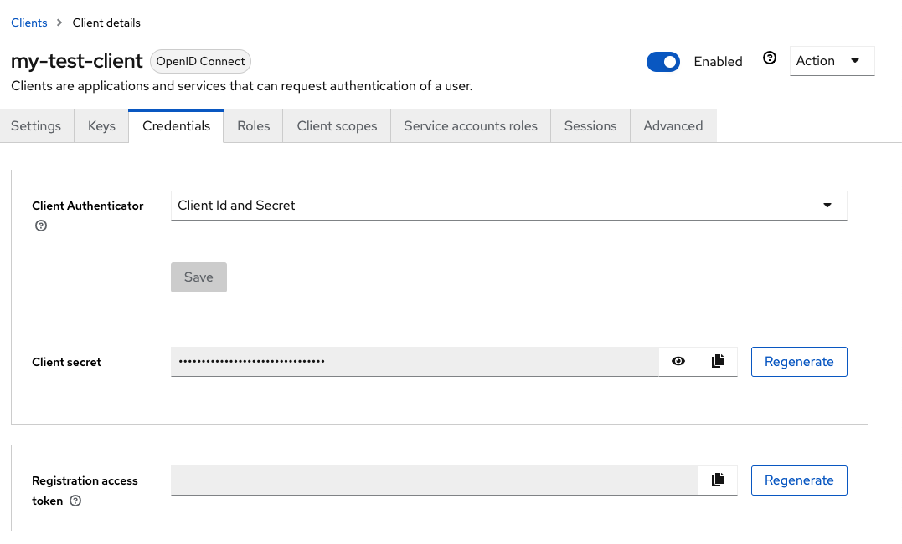

# Retrieve the Client Secret for Service Accounts

Get the client secret that is generated by Keycloak when the client or service account was created. The secret can be regenerated any time with an administrative action.

A client secret is needed to make requests using a new client or service account.

### Prerequisites

A client or service account has been created. See [Create a Service Account in Keycloak](Create_a_Service_Account_in_Keycloak.md).

### Procedure

Follow the steps in only one of the sections below depending on if it is preferred to use the Keycloak REST API or Keycloak administration console UI.


#### Use the Keycloak Administration Console UI

1.  Log in to the administration console.

    See [Access the Keycloak User Management UI](Access_the_Keycloak_User_Management_UI.md) for more information.

2.  Click on **Clients** under the Configure header of the navigation panel on the left side of the page.

3.  Click on the ID for the target client in the Clients table.

4.  Switch to the **Credentials** tab.

5.  Save the client secret stored in the Secret field.

    

6.  Create a variable for the client secret.

    Leave the Keycloak UI and create a variable for the client secret on the system.

    Replace 8a91fdf2-f9c5-4c7f-8da8-49cfbb97680a with the client secret returned for the service account being used.

    ```bash
    ncn-w001# export CLIENT_SECRET=8a91fdf2-f9c5-4c7f-8da8-49cfbb97680a
    ```


#### Use the Keycloak REST API

1.  Create the get\_master\_token function to get a token as a Keycloak master administrator.

    ```bash
    MASTER_USERNAME=$(kubectl get secret -n services keycloak-master-admin-auth -ojsonpath='{.data.user}' | base64 -d)
    MASTER_PASSWORD=$(kubectl get secret -n services keycloak-master-admin-auth -ojsonpath='{.data.password}' | base64 -d)

    function get_master_token {
      curl -ks -d client_id=admin-cli -d username=$MASTER_USERNAME -d password=$MASTER_PASSWORD -d grant_type=password https://api-gw-service-nmn.local/keycloak/realms/master/protocol/openid-connect/token | python -c "import sys.json; print json.load(sys.stdin)['access_token']"
    }
    ```

2.  Get a unique ID for a client from Keycloak.

    In the example below, the client ID is my-test-client, which should be replaced with the client ID for the target client. The returned 82d009de-1e36-41b6-8c21-4c390a25c188 in the output is the unique ID of the client.

    ```bash
    ncn-w001# CLIENT_ID=$(curl -s -H "Authorization: Bearer $(get_master_token)" \
    https://api-gw-service-nmn.local/keycloak/admin/realms/shasta/clients | jq -r '.[] \
    | select(.clientId=="my-test-client").id')

    ncn-w001# echo $CLIENT_ID
    82d009de-1e36-41b6-8c21-4c390a25c188
    ```

3.  Retrieve the client secret.

    In the example below, the returned client secret is 8a91fdf2-f9c5-4c7f-8da8-49cfbb97680a.

    ```bash
    ncn-w001# curl -s -H "Authorization: Bearer $(get_master_token)" \
    https://api-gw-service-nmn.local/keycloak/admin/realms/shasta/clients/$CLIENT_ID/client-secret | jq -r .value
    8a91fdf2-f9c5-4c7f-8da8-49cfbb97680a
    ```

4.  Create a variable for the client secret.

    Replace 8a91fdf2-f9c5-4c7f-8da8-49cfbb97680a with the client secret returned for the service account being used.

    ```bash
    ncn-w001# export CLIENT_SECRET=8a91fdf2-f9c5-4c7f-8da8-49cfbb97680a
    ```

