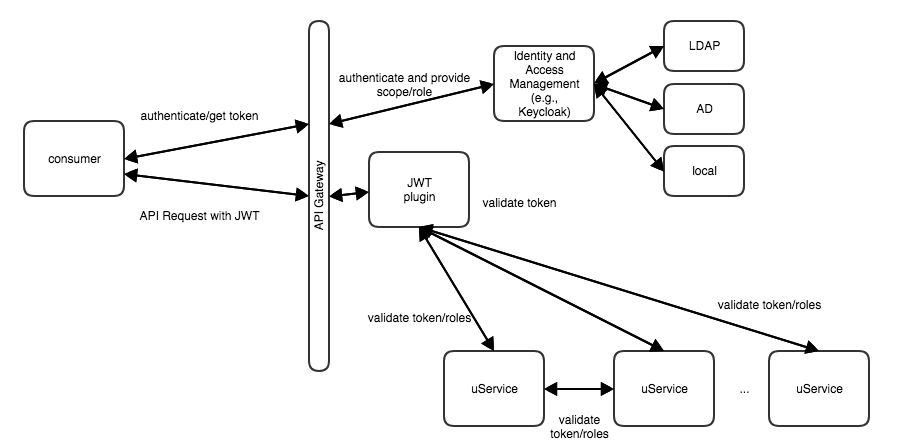

## System Security and Authentication

The system uses a number of mechanisms to ensure the security and authentication of internal and external requests.

-   **API Gateway service** - The Cray API Gateway service provides a common access gateway for all of the systems management REST APIs. Authentication is provided by an Identity and Access Management \(IAM\) service that integrates with Istio.
-   **Keycloak** - Keycloak is an open source Identity and Access Management \(IAM\) solution. It provides authentication and authorization services that are used to secure access to services on the system.

    To learn more about Keycloak, refer to [https://www.keycloak.org/](https://www.keycloak.org/).

-   **JSON Web Tokens \(JWT\)** - The approach for system management authentication and authorization is to leverage the OpenID Connect standard, as much as practical. OpenID Connect consists of a specific application of the OAuth v2.0 standard, which leverages the use of JSON Web Tokens \(JWT\).

All connections through the Istio ingress gateway require authentication with a valid JWT from Keycloak, except for the following endpoints accessed via the `shasta` external hostname:

-   /keycloak
-   /apis/tokens
-   /vcs
-   /spire-jwks-
-   /spire-bundle
-   /meta-data
-   /user-data
-   /phone-home
-   /repository
-   /v2
-   /service/rest
-   /capsules/

### Table of Contents

-   [Manage System Passwords](Manage_System_Passwords.md)
    -   [Update NCN Passwords](Update_NCN_Passwords.md)
    -   [Change Root Passwords for Compute Nodes](Change_Root_Passwords_for_Compute_Nodes.md)
    -   [Change NCN Image Root Password and SSH Keys](Change_NCN_Image_Root_Password_and_SSH_Keys.md)
    -   [Change EX Liquid-Cooled Cabinet Global Default Password](Change_EX_Liquid-Cooled_Cabinet_Global_Default_Password.md)
    -   [Provisioning a Liquid-Cooled EX Cabinet CEC with Default Credentials](Provisioning_a_Liquid-Cooled_EX_Cabinet_CEC_with_Default_Credentials.md)
    -   [Updating the Liquid-Cooled EX Cabinet Default Credentials after a CEC Password Change](Updating_the_Liquid-Cooled_EX_Cabinet_Default_Credentials_after_a_CEC_Password_Change.md)
-   [SSH Keys](SSH_Keys.md)
-   [Authenticate an Account with the Command Line](Authenticate_an_Account_with_the_Command_Line.md)
-   [Default Keycloak Realms, Accounts, and Clients](Default_Keycloak_Realms_Accounts_and_Clients.md)
    -   [Certificate Types](Certificate_Types.md)
    -   [Change the Keycloak Admin Password](Change_the_Keycloak_Admin_Password.md)
    -   [Create a Service Account in Keycloak](Create_a_Service_Account_in_Keycloak.md)
    -   [Retrieve the Client Secret for Service Accounts](Retrieve_the_Client_Secret_for_Service_Accounts.md)
    -   [Get a Long-Lived Token for a Service Account](Get_a_Long-lived_Token_for_a_Service_Account.md)
    -   [Access the Keycloak User Management UI](Access_the_Keycloak_User_Management_UI.md)
    -   [Create Internal User Accounts in the Keycloak Shasta Realm](Create_Internal_User_Accounts_in_the_Keycloak_Shasta_Realm.md)
    -   [Delete Internal User Accounts in the Keycloak Shasta Realm](Delete_Internal_User_Accounts_from_the_Keycloak_Shasta_Realm.md)
    -   [Create Internal User Groups in the Keycloak Shasta Realm](Create_Internal_User_Accounts_in_the_Keycloak_Shasta_Realm.md)
    -   [Remove Internal Groups from the Keycloak Shasta Realm](Remove_Internal_Groups_from_the_Keycloak_Shasta_Realm.md)
    -   [Remove the Email Mapper from the LDAP User Federation](Remove_the_Email_Mapper_from_the_LDAP_User_Federation.md)
    -   [Re-Sync Keycloak Users to Compute Nodes](Resync_Keycloak_Users_to_Compute_Nodes.md)
    -   [Keycloak Operations](Keycloak_Operations.md)
    -   [Configure Keycloak for LDAP/AD authentication](Configure_Keycloak_for_LDAPAD_Authentication.md)
    -   [Configure the RSA Plugin in Keycloak](Configure_the_RSA_Plugin_in_Keycloak.md)
    -   [Preserve Username Capitalization for Users Exported from Keycloak](Preserve_Username_Capitalization_for_Users_Exported_from_Keycloak.md)
    -   [Change the LDAP Server IP Address for Existing LDAP Server Content](Change_the_LDAP_Server_IP_Address_for_Existing_LDAP_Server_Content.md)
    -   [Change the LDAP Server IP Address for New LDAP Server Content](Change_the_LDAP_Server_IP_Address_for_New_LDAP_Server_Content.md)
    -   [Remove the LDAP User Federation from Keycloak](Remove_the_LDAP_User_Federation_from_Keycloak.md)
    -   [Add LDAP User Federation](Add_LDAP_User_Federation.md)
-   [Public Key Infrastructure \(PKI\)](Public_Key_Infrastructure_PKI.md)
    -   [PKI Certificate Authority \(CA\)](PKI_Certificate_Authority_CA.md)
    -   [Make HTTPS Requests from Sources Outside the Management Kubernetes Cluster](Make_HTTPS_Requests_from_Sources_Outside_the_Management_Kubernetes_Cluster.md)
    -   [Transport Layer Security \(TLS\) for Ingress Services](Transport_Layer_Security_for_Ingress_Services.md)
    -   [PKI Services](PKI_Services.md)
    -   [HashiCorp Vault](HashiCorp_Vault.md)
    -   [Backup and Restore Vault Clusters](Backup_and_Restore_Vault_Clusters.md)
    -   [Troubleshoot Common Vault Cluster Issues](Troubleshoot_Common_Vault_Cluster_Issues.md)
-   [Public Key Infrastructure \(PKI\)](Public_Key_Infrastructure_PKI.md)
    -   [PKI Certificate Authority \(CA\)](PKI_Certificate_Authority_CA.md)
    -   [Make HTTPS Requests from Sources Outside the Management Kubernetes Cluster](Make_HTTPS_Requests_from_Sources_Outside_the_Management_Kubernetes_Cluster.md)
    -   [Transport Layer Security \(TLS\) for Ingress Services](Transport_Layer_Security_for_Ingress_Services.md)
    -   [PKI Services](PKI_Services.md)
    -   [HashiCorp Vault](HashiCorp_Vault.md)
    -   [Backup and Restore Vault Clusters](Backup_and_Restore_Vault_Clusters.md)
    -   [Troubleshoot Common Vault Cluster Issues](Troubleshoot_Common_Vault_Cluster_Issues.md)
-   [Troubleshoot SPIRE Failing to Start on NCNs](Troubleshoot_SPIRE_Failing_to_Start_on_NCNs.md)
-   [API Authorization](API_Authorization.md)
