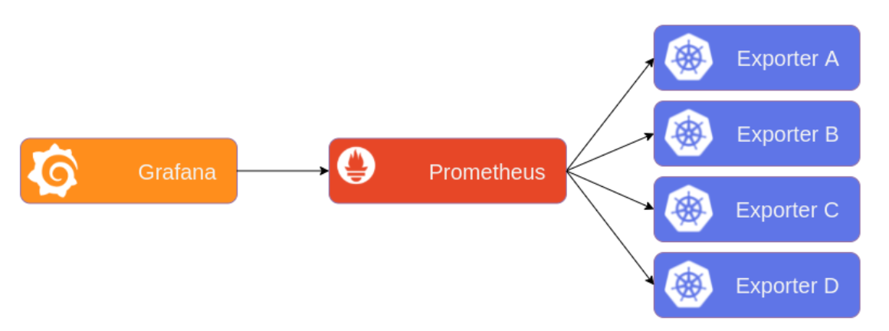
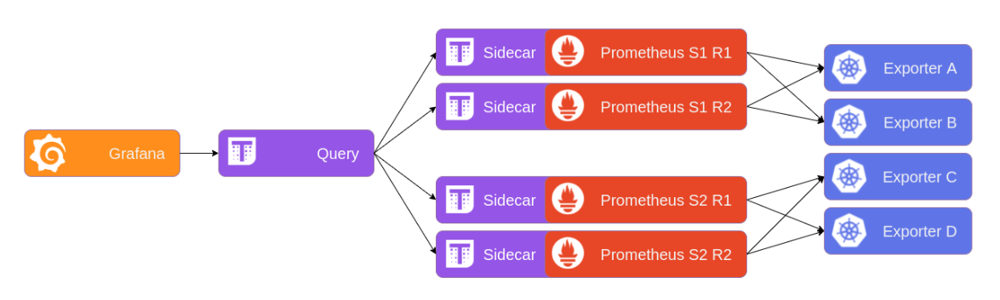

# Thanos

Thanos is a set of components that can be composed into a highly available, multi Prometheus metric system with potentially unlimited storage capacity, if your Object Storage allows for it.
It leverages the Prometheus 2.0 storage format to cost-efficiently store historical metric data in any object storage while retaining fast query latencies.
Additionally, it provides a global query view across all Prometheus installations and can merge data from Prometheus HA pairs.

Concretely the aims of the project are:

- Availability: (reliable with a high uptime)
- Scalability: (able to scale horizontally and handle the load)
- Global query view of metrics.
- Durability: (keep metrics for a long time)
- Performance: (return results reasonably quickly)

## Architecture without Thanos



## Architecture with Thanos



Thanos provides a global query view, high availability, data backup with historical, cheap data access as its core features in a single binary.
These features can be deployed independently of each other.

## Features

- Global querying view across all connected Prometheus servers.
- De-duplication and merging of metrics collected from Prometheus HA pairs.
- Seamless integration with existing Prometheus setups.
- Any object storage as its only, optional dependency.
- Down sampling historical data for massive query speed up.
- Fault-tolerant query routing.
- Simple gRPC "Store API" for unified data access across all metric data.
- Easy integration points for custom metric providers.
- Unlimited retention of historical data in thanos S3 bucket.

## Thanos Components

Prometheus Operator can manage:

- Thanos sidecar component with the Prometheus custom resource definition. Deployed within the Prometheus pod, it can hook into the Thanos querying system as well as optionally back up your data to object storage.

- Thanos Ruler instances with the `ThanosRuler` custom resource definition.
Other Thanos components such the Querier, the Receiver, the Compactor and the Store Gateway should be deployed independently of the Prometheus Operator and its Thanos configuration.

### Thanos Sidecar

The Prometheus CRD has support for adding a Thanos sidecar to the Prometheus Pod. To enable the sidecar, the thanos section must be set to a non empty value and specify this secret inside the Thanos field of the Prometheus spec.
For example, the simplest configuration is to just set a valid thanos container image URL and secret.

```yaml
spec:
  ...
  thanos:
    image: quay.io/thanos/thanos:v0.31.0
    objectStorageConfig:
       key: thanos.yaml
       name: thanos-objstore-config
```

#### Configuring Thanos Object Storage

You can configure the Thanos sidecar to upload TSDB blocks to object storage by providing a Kubernetes Secret containing the required configuration.
Once you have written your configuration save it to a file. Here's an example:

```yaml
type: s3
config:
  bucket: thanos
  endpoint: ams3.digitaloceanspaces.com
  access_key: XXX
  secret_key: XXX
```

This will attach Thanos sidecar that will backup all new blocks that Prometheus produces every 2 hours to the object storage.

NOTE: This option will also disable the local Prometheus compaction. This means that Thanos compactor is the main singleton component responsible for compaction on a global, object storage level.

### Thanos Ruler

The `Thanos Ruler` component allows recording and alerting rules to be processed across multiple Prometheus instances. A `ThanosRuler` instance requires at least one `queryEndpoint` which points to the location of Thanos querier or Prometheus instances.
The `queryEndpoint` is used to configure the `--query` arguments(s) of the `Thanos ruler`.

```yaml
apiVersion: monitoring.coreos.com/v1
kind: ThanosRuler
metadata:
  name: thanos-ruler-demo
  labels:
    example: thanos-ruler
  namespace: monitoring
spec:
  image: quay.io/thanos/thanos:v0.31.0
  ruleSelector:
    matchLabels:
      role: my-thanos-rules
  queryEndpoints:
    - dnssrv+_http._tcp.my-thanos-querier.monitoring.svc.cluster.local
```

The recording and alerting rules used by a `ThanosRuler` component, are configured using the same `PrometheusRule` objects which are used by Prometheus.
In the given example, the rules contained in any `PrometheusRule` object which match the label `role=my-thanos-rules` will be loaded by the Thanos Ruler pods.

### Thanos Querier/Query

Thanos query provides global view of metrics. It gathers the data needed to evaluate the query from underlying StoreAPIs, evaluates the query, and returns the result.
Querier is fully stateless and horizontally scalable.

Example command to run Querier:

```yaml
thanos query \
--http-address     "0.0.0.0:9090"\
--endpoint         "<store-api>:<grpc-port>"\
--endpoint         "<store-api2>:<grpc-port>"
```

### Thanos Store

The `thanos store` command (also known as Store Gateway) implements the Store API on top of historical data in an object storage bucket. It acts primarily as an API gateway and therefore does not need significant amounts of local disk space.
It joins a Thanos cluster on startup and advertises the data it can access. It keeps a small amount of information about all remote blocks on local disk and keeps it in sync with the bucket.
This data is generally safe to delete across restarts at the cost of increased startup times.

```yaml
thanos store \
--data-dir        "/local/state/data/dir"\
--objstore.config-file "bucket.yml"
```

In general, an average of 6 MB of local disk space is required per TSDB block stored in the object storage bucket, but for high cardinality blocks with large label set it can even go up to 30MB and more.
It is for the pre-computed index, which includes symbols and postings offsets as well as metadata JSON.

### Thanos Compactor

The `thanos compact` command applies the compaction procedure of the Prometheus 2.0 storage engine to block data stored in object storage.
The Compactor, among other things, is responsible for compacting multiple blocks into one.
Why even compact? This is a process, also done by Prometheus, to reduce the number of blocks and compact index indices. We can compact an index quite well in most cases, because series usually live longer than the duration of the smallest blocks (2 hours).

#### Downsampling

Compactor is also responsible for downsampling of data. It is a process of rewriting series to reduce overall resolution of the samples without losing accuracy over longer time ranges.
There is a time delay before downsampling at a given resolution is possible. This is necessary because downsampled chunks will have fewer samples in them, and as chunks are fixed size, data spanning more time will be required to fill them.

Resolution is a distance between data points on graphs. E.g.

1. raw - the same as scrape interval at the moment of data ingestion.

1. 5 minutes - data point is every 5 minutes.

1. 1 hour - data point is every 1 hour.

Compactor downsampling is done in two passes:

1. All raw resolution metrics that are older than 40 hours are downsampled at a 5 minutes resolution.

1. All 5 minutes resolution metrics older than 10 days are downsampled at a 1 hour resolution.

#### Retention of data

By default, there is NO retention set for object storage data. This means that you store data forever, which is a valid and recommended way of running Thanos.
We can configure retention by using `--retention.resolution-raw` , `--retention.resolution-5m` and `--retention.resolution-1h flag`. Not setting them or setting to 0 second means no retention.

Configure in `cray-sysmgmt-health/kubernetes/cray-sysmgmt-health/values.yaml`

```yaml
thanosCompactor:
  resolutionraw: 0d
  resolution5m: 0d
  resolution1h: 0d
```

NOTE: If retention at each resolution is lower than minimum age for the successive downsampling pass, data will be deleted before downsampling can be completed.
As a rule of thumb retention for each downsampling level should be the same, and should be greater than the maximum date range (10 days for 5 minutes to 1 hour downsampling).
