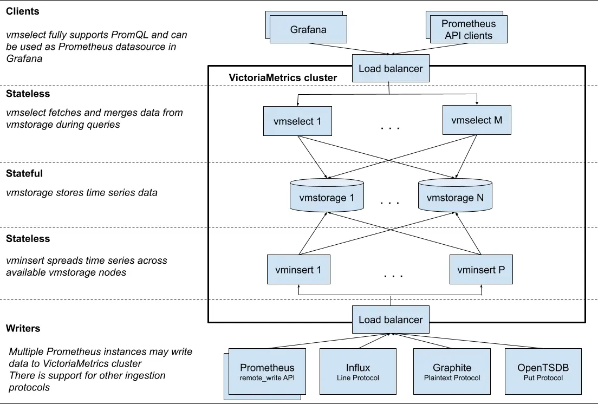

# VictoriaMetrics

VictoriaMetrics is a fast, cost-effective, and scalable time series database. It can be used as a long-term remote storage for Prometheus.

It is recommended to use the single-node version instead of the cluster version for ingestion rates lower than a million data points per second.
The single-node version scales perfectly with the number of CPU cores, RAM, and available storage space.

- [Prominent features](#prominent-features)
- [Architecture overview](#architecture-overview)
    - [`vmstorage`](#vmstorage)
    - [`vminsert`](#vminsert)
    - [`vmselect`](#vmselect)
    - [`vmagent`](#vmagent)
    - [`vmalert`](#vmalert)
- [Cluster resizing and scalability](#cluster-resizing-and-scalability)

## Prominent features

- Supports all the features of the single-node version.
- Performance and capacity scale horizontally.
- Supports multiple independent namespaces for time series data (aka multi-tenancy).
- Supports replication.

## Architecture overview



The VictoriaMetrics cluster consists of several services.
Each service may scale independently and may run on the most suitable hardware.
`vmstorage` nodes do not know about each other, do not communicate with each other and do not share any data.
This is a shared nothing architecture. It increases cluster availability, and simplifies cluster maintenance as well as cluster scaling.

The VictoriaMetrics cluster consists of the following services:

### `vmstorage`

`vmstorage` stores the raw data and returns the queried data on the given time range for the given label filters.
This is the only stateful component in the cluster.

### `vminsert`

`vminsert` accepts the ingested data and spreads it among `vmstorage` nodes according to consistent hashing over metric name and all its labels.

### `vmselect`

`vmselect` performs incoming queries by fetching the needed data from all the configured `vmstoragenodes`.
To access the `vmselect` GUI, use SSH port-forwarding.

1. (`ncn-mw#`) Get the port number of the `vmselect-vms` service.

    ```bash
    kubectl get service -n sysmgmt-health vmselect-vms
    ```

    Expected output looks similar to the following:

    ```text
    NAME                               TYPE        CLUSTER-IP    EXTERNAL-IP   PORT(S)              AGE
    vmselect-vms                       ClusterIP       None      <none>        8481/TCP             122d
    ```

1. (`ncn-mw#`) Enable Kubernetes port forwarding, using the `vmselect-vms` service name and the port number from the previous step.

   ```bash
   kubectl port-forward -n sysmgmt-health service/vmselect-vms 8481:8481
   ```

1. Use a local laptop or desktop command line to access the cluster.

    > Replace `SYSTEM-IP` with the IP address of the NCN used for the previous step.

    ```console
    ssh -L 8481:localhost:8481 root@SYSTEM-IP
    ```

1. Open `http://localhost:8481/select/0/prometheus/vmui/` in the browser to access the GUI.

### `vmagent`

`vmagent` is a tiny but powerful agent which helps collect metrics from various sources and stores them in VictoriaMetrics
(or any other Prometheus-compatible storage systems that support the `remote_write` protocol).

To access the `vmagent` GUI, use SSH port-forwarding.

1. (`ncn-mw#`) Get the IP address and port number of the `vmagent-vms` service.

    ```bash
    kubectl get svc -n sysmgmt-health vmagent-vms
    ```

    Expected output looks similar to the following:

    ```text
    NAME                               TYPE        CLUSTER-IP    EXTERNAL-IP   PORT(S)              AGE
    vmagent-vms                        ClusterIP   10.17.40.41   <none>        8429/TCP             6d5h
    ```

1. Enable SSH port forwarding, using the IP address and port number from the previous step.

    > Replace `SYSTEM-IP` with the IP address of a master or worker NCN.

    ```console
    ssh root@SYSTEM-IP -L 8429:10.17.40.41:8429
    ```

1. Open `localhost:8429` in the browser to access the GUI.

### `vmalert`

`vmalert` executes a list of the given alerting or recording rules against configured data sources.
When sending alerting notifications, `vmalert` relies on configured Alertmanager.
Recording rules results are persisted via remote write protocol.
`vmalert` is heavily inspired by Prometheus implementation and aims to be compatible with its syntax.

## Cluster resizing and scalability

Cluster performance and capacity can be scaled up in two ways:

- Vertical scalability: Adding more resources (CPU, RAM, disk IO, disk space, and so on).
- Horizontal scalability: Adding more of each component to the cluster.
