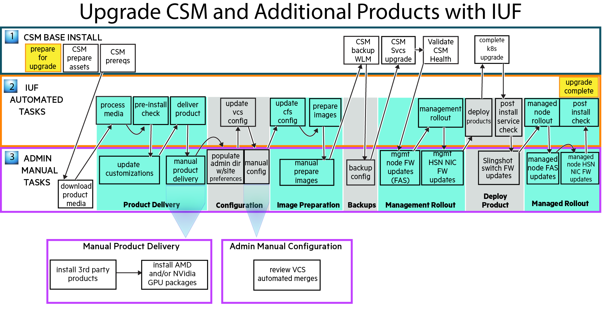

# Upgrade only CSM through IUF

This option describes how to upgrade Cray Systems Management (CSM) software on a CSM-only system
using IUF.

1. CSM preparation

   Read the _Important Notes_ section of the
   [CSM 1.5.0 or later to 1.6.0 Upgrade Process](Upgrade_Management_Nodes_and_CSM_Services.md)
   documentation and then follow only these CSM instructions in order:

   1. [Prepare for Upgrade](prepare_for_upgrade.md)

1. Prepare for the upgrade procedure and download product media

   1. Follow the IUF [Prepare for the install or upgrade](../operations/iuf/workflows/preparation.md) instructions to set
      environment variables used during the upgrade process.

   1. Download the desired HPE product media defined by the HPC CSM Software Recipe to `${MEDIA_DIR}`, which was defined in the previous step.

1. Product delivery

   Follow the IUF [Product delivery](../operations/iuf/workflows/product_delivery.md) instructions.

1. Configuration

   Follow the IUF [Configuration](../operations/iuf/workflows/configuration.md) instructions.

1. Image preparation

   Follow the IUF [Image preparation](../operations/iuf/workflows/image_preparation.md) instructions.

1. Management rollout

   Follow the IUF [Management rollout](../operations/iuf/workflows/management_rollout.md) instructions.

1. Deploy product

   Follow these IUF instructions in order:

   1. [Deploy product](../operations/iuf/workflows/deploy_product.md)
   1. [Validate deployment](../operations/iuf/workflows/validate_deployment.md)

The IUF upgrade workflow is now complete. Exit any typescript sessions created during the upgrade
procedure and remove any installation artifacts, if desired.
