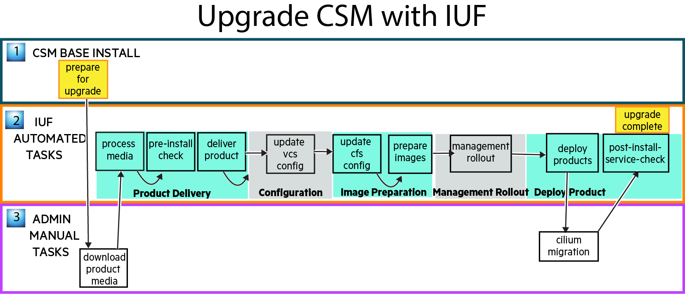

# Upgrade Only CSM Through IUF

This option describes how to upgrade Cray Systems Management (CSM) software on a CSM-only system
using IUF.

## Description

The upgrade from CSM 1.6 to CSM 1.7 uses the IUF framework. The CSM upgrade steps are run automatically, either directly through IUF stages or by running a hook at the beginning or end of an IUF stage.

## Upgrade procedure

1. Read the _Important Notes_ section of the
   [CSM 1.6.0 or later to 1.7 Upgrade Process](Upgrade_Management_Nodes_and_CSM_Services.md)
   documentation.

1. [Prepare for Upgrade to Next CSM Major Version](https://cray-hpe.github.io/docs-csm/en-16/upgrade/prepare_for_upgrade_to_next_csm_major_version/)
   in the CSM 1.6 documentation.

1. Prepare for the upgrade procedure and download product media.

   1. Follow the IUF [Prepare for the Install or Upgrade](../operations/iuf/workflows/preparation.md) instructions to set
      environment variables used during the upgrade process.

   1. Download the desired HPE product media defined by the HPC CSM Software Recipe to `${MEDIA_DIR}`, which was defined in the previous step.

1. Perform product delivery.

   Follow the IUF [Product Delivery](../operations/iuf/workflows/product_delivery.md) instructions.

1. Prepare images.

   Follow the IUF [Image Preparation](../operations/iuf/workflows/image_preparation.md) instructions.

1. Perform management node rollout.

   Follow the IUF [Management Rollout](../operations/iuf/workflows/management_rollout.md) instructions.

1. Deploy products.

   Follow these IUF instructions in order:

   1. [Deploy Product](../operations/iuf/workflows/deploy_product.md)
   1. [Cilium Migration](../operations/iuf/workflows/cilium_migration.md)
   1. [Validate Deployment](../operations/iuf/workflows/validate_deployment.md)

   **NOTE** After completing this step, run the [Validate CSM Health](../operations/validate_csm_health.md) checks to verify the upgrade was successful.

The IUF upgrade workflow is now complete. Exit any typescript sessions created during the upgrade
procedure and remove any installation artifacts, if desired.
