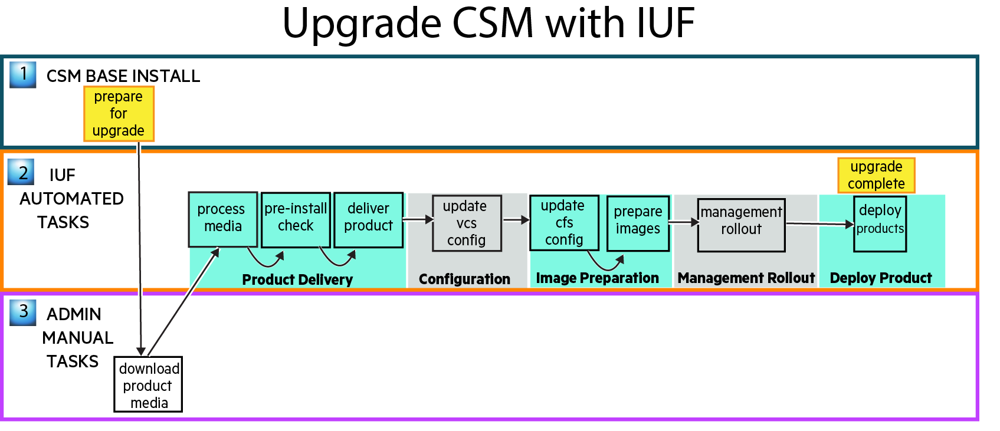

# Upgrade only CSM through IUF

This option describes how to upgrade Cray Systems Management (CSM) software on a CSM-only system
using IUF.

## Description

The upgrade from CSM 1.5 to CSM 1.6 uses the IUF framework. The CSM upgrade steps are run automatically, either directly through IUF stages or by running a hook at the beginning or end of an IUF stage.
The hooks that are run for the CSM upgrade are described below.

- CSM upgrade prerequisites

   CSM upgrade prerequisites are executed in a hook run before `pre-install-check`. This executes steps that are dependencies for later CSM upgrade steps.
   This includes some service chart upgrades, uploading base NCN images to be used later in `prepare-images`, and other setup steps.
   The specific script that is being executed is `/usr/share/doc/csm/upgrade/scripts/upgrade/prerequisites.sh`.

- CSM services upgrade and validate CSM health

   CSM services upgrade and validate CSM health are executed in a hook run before `management-nodes-rollout`. This hook is only executed before the first NCN is upgraded.
   The specific script that executes the CSM services upgrade is `/usr/share/doc/csm/upgrade/scripts/upgrade/csm-upgrade.sh`.

- Apply networking, apply CoreDNS anti-affinity, and upgrade Kubernetes control plane

   Apply networking, apply CoreDNS anti-affinity, and completing the Kubernetes control plane upgrade is executed in a hook run after `deploy-product`.
   The specific scripts executed as part of this hook are `/srv/cray/scripts/common/apply-networking-manifests.sh`, `/usr/share/doc/csm/upgrade/scripts/k8s/apply-coredns-pod-affinity.sh`, and `/usr/share/doc/csm/upgrade/scripts/k8s/upgrade_control_plane.sh`.

## Upgrade Procedure

1. CSM preparation

   Read the _Important Notes_ section of the
   [CSM 1.5.0 or later to 1.6.0 Upgrade Process](Upgrade_Management_Nodes_and_CSM_Services.md)
   documentation and then follow only these CSM instructions in order:

   1. [Prepare for Upgrade](prepare_for_upgrade.md)

1. Prepare for the upgrade procedure and download product media

   1. Follow the IUF [Prepare for the install or upgrade](../operations/iuf/workflows/preparation.md) instructions to set
      environment variables used during the upgrade process.

   1. Download the desired HPE product media defined by the HPC CSM Software Recipe to `${MEDIA_DIR}`, which was defined in the previous step.

1. Product delivery

   > **NOTE** The CSM upgrade prerequisites are automatically executed in a hook run before `pre-install-check`.

   Follow the IUF [Product delivery](../operations/iuf/workflows/product_delivery.md) instructions.

1. Configuration

   Follow the IUF [Configuration](../operations/iuf/workflows/configuration.md) instructions.

1. Image preparation

   Follow the IUF [Image preparation](../operations/iuf/workflows/image_preparation.md) instructions.

1. Management rollout

   > **NOTE** The CSM services upgrade and validate CSM health are automatically executed in a hook run before the first management node is rolled out.

   Follow the IUF [Management rollout](../operations/iuf/workflows/management_rollout.md) instructions.

1. Deploy product

   > **NOTE**  Networking and CoreDNS anti-affinity are applied and the Kubernetes control plane is upgraded in a hook automatically executed at the end of `deploy-product`.

   Follow these IUF instructions in order:

   1. [Deploy product](../operations/iuf/workflows/deploy_product.md)
   1. [Validate deployment](../operations/iuf/workflows/validate_deployment.md)

The IUF upgrade workflow is now complete. Exit any typescript sessions created during the upgrade
procedure and remove any installation artifacts, if desired.
